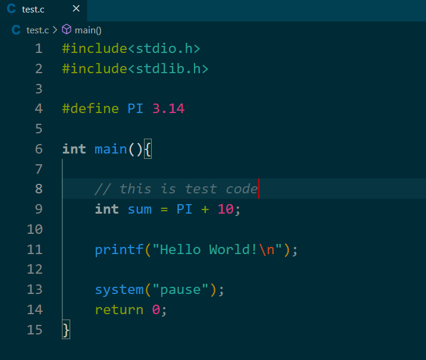
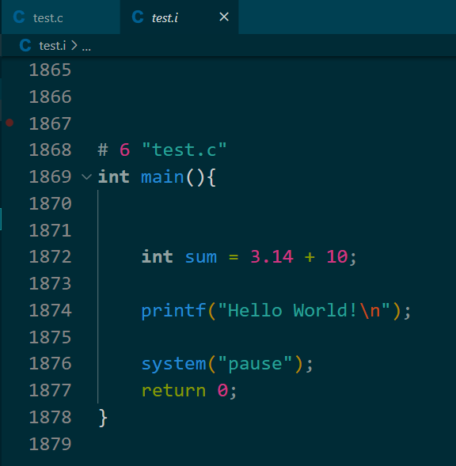
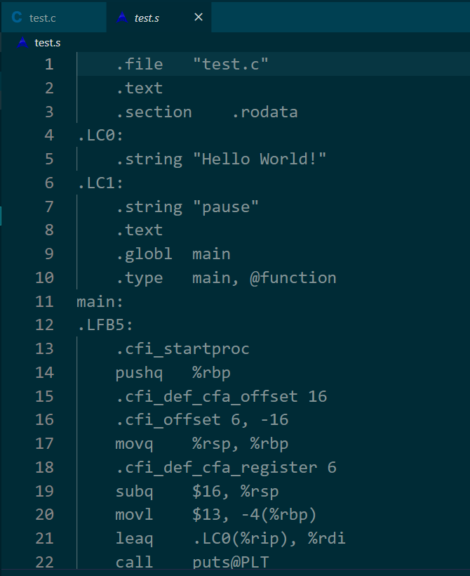
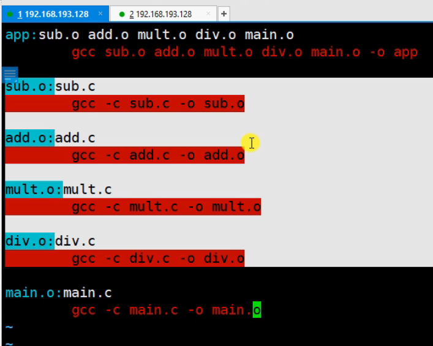
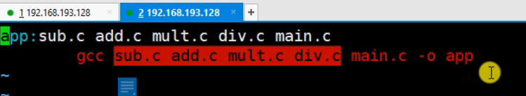
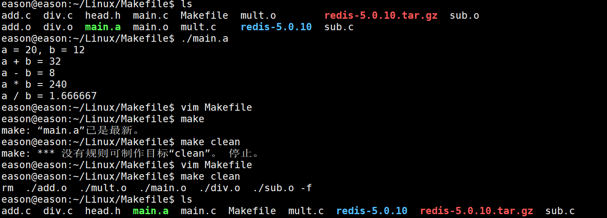

- [Linux开发环境搭建](#linux开发环境搭建)
- [GCC](#gcc)
  - [GCC安装](#gcc安装)
  - [GCC工作流程](#gcc工作流程)
  - [工作流程演示](#工作流程演示)
- [静态库](#静态库)
  - [静态库的制作](#静态库的制作)
    - [命名规则](#命名规则)
    - [制作过程](#制作过程)
    - [制作过程演示](#制作过程演示)
  - [静态库的使用](#静态库的使用)
- [动态库](#动态库)
  - [动态库的制作和使用](#动态库的制作和使用)
    - [命名规则](#命名规则-1)
    - [动态库的制作](#动态库的制作)
  - [动态库加载失败的原因](#动态库加载失败的原因)
  - [解决动态库加载失败的问题](#解决动态库加载失败的问题)
    - [方法一：添加环境变量LD\_LIBRARY\_PATH](#方法一添加环境变量ld_library_path)
      - [添加临时环境变量](#添加临时环境变量)
      - [用户级别下配置永久环境变量](#用户级别下配置永久环境变量)
      - [系统级别下配置永久环境变量](#系统级别下配置永久环境变量)
    - [方法二：修改/etc/ld.so.cache文件列表](#方法二修改etcldsocache文件列表)
    - [方法三：把文件放入/lib/，/usr/lib目录](#方法三把文件放入libusrlib目录)
  - [静态库和动态库的对比](#静态库和动态库的对比)
- [Makefile](#makefile)
  - [为什么需要Makefile](#为什么需要makefile)
  - [Makefile文件命名和规则](#makefile文件命名和规则)
    - [文件命名](#文件命名)
    - [Makefile规则](#makefile规则)
  - [Makefile工作原理](#makefile工作原理)
  - [Makefile变量](#makefile变量)
    - [规则](#规则)
    - [用法举例：](#用法举例)
    - [实际操作演示](#实际操作演示)
  - [Makefile模式匹配](#makefile模式匹配)
  - [Makefile函数](#makefile函数)
- [GDB调试](#gdb调试)
  - [准备工作](#准备工作)
  - [GDB命令](#gdb命令)
- [文件I/O](#文件io)
  - [标准C库I/O函数和Linux系统I/O函数对比](#标准c库io函数和linux系统io函数对比)
  - [虚拟地址空间](#虚拟地址空间)
  - [文件描述符](#文件描述符)
  - [Linux系统I/O函数](#linux系统io函数)
  - [模拟实现ls-l指令](#模拟实现ls-l指令)
  - [文件属性操作函数](#文件属性操作函数)
  - [目录操作函数](#目录操作函数)
  - [目录遍历函数](#目录遍历函数)
  - [dup和dup2函数](#dup和dup2函数)
  - [fcntl函数](#fcntl函数)


# Linux开发环境搭建
这节课主要讲了如何安装vmware、vmware下如何安装ubuntu、使用Xshell和vscode连接ubuntu，详见视频。   
遇到问题先看评论区，找不到再看博客。


# GCC


## GCC安装
我们在编辑器写好代码后，要运行，这个时候就需要GCC工具的帮助了。   
在终端输入以下指令安装GCC以及检查版本：   
```
sudo apt install gcc g++   # 安装
gcc/g++ -v/--version   # 查询版本
```


## GCC工作流程  
   
由图可以看到，我们首先需要在代码编辑器上书写源代码文件 **.h/.c/.cpp** 文件，源代码文件经预处理器处理后得到 **.i** 文件，之后再经过编译器得到汇编代码 **.s** 文件，接着通过汇编器处理得到目标代码文件 **.o** 文件；该文件和启动代码、库代码、其他目标代码经过链接器链接得到可执行程序 **.exe/.out** 文件。   
所以，整个工作流程先后产生如下文件：**.h/.c/.cpp -> .i -> .s -> .o -> .exe/.out**。

<a name="标题1-1"></a>
## 工作流程演示
首先需要了解GCC编译常用参数选项，如图：   
   


首先在vscode上书写test.c文件，如下图：   
   

接着在终端输入以下指令对文件进行预处理得到test.i文件，
```shell
gcc test.c -E -o test.i
```   
  
打开test.i文件，发现前面有一长串对于#include库的展开；拉到最后面，可以看到预处理后的代码如下：   
   
- 可以发现，#include引入的库已经在前面展开了，所以这里没有显示
- 同时#define定义的常量也被替换到代码里面了
- 注释this is test code也消失了      
   
之后对test.i文件进行编译操作，得到test.s文件，
```shell
gcc test.i -S -o test.s
```
打开test.s文件，可以看到一系列汇编代码，就是在学计算机组成原理和汇编原理看到的汇编代码，如图：   
   


之后对test.s文件进行汇编操作，得到test.o文件，
```shell
gcc test.s -s -o test.o
```
此时想打开test.o文件，会发现打不开，因为是二进制文件，如图:   
   

链接生成可执行文件，直接输入以下代码一步到位：
```shell
./test.o
```
如图：   
 


# 静态库  


## 静态库的制作
     

### 命名规则
- Linux：libxxx.a   
lib：前缀，固定   
xxx：库的名字，自己定   
.a：后缀，固定   
   
- Windows：libxxx.lib

### 制作过程   
- gcc获得 **.o** 文件
- 将 **.o** 文件打包，使用ar工具(archive)
```
ar rcs libxxx.a xxx.o xxx.o
r-将文件插入备存文件中
c-建立备存文件
s-索引
```   

### 制作过程演示
往ubuntu里面拖入两个文件：calc和library(在课程文件里下载)，打开后发现calc有如下文件：   
   

因为制作需要 **.o** 文件，所以需要先根据calc里面的 **.c** 文件编译汇编得到，输入如下指令：
```shell
gcc -c add.c div.c mult.c sub.c
```
可以得到如图所示效果：   
   

接着将 **.o** 文件打包得到静态库文件，首先输入以下指令：   
```shell
ar rcs libcalc.a add.o div.o mult.o sub.o
```
可以得到所示文件：
   


## 静态库的使用  
打开引入的library文件，看里面有什么内容：   
   

可以发现里面有几个文件：include、lib、main.c、src。其实我们平常在github上下载的源码的结构也和这个类似，include里面存储的是我们需要的头文件，lib里面存储的是操作需要用到的库，main.c是运行文件，src文件夹里面存储的是头文件里面所声明的函数的定义。      

同时可以看到此时lib文件夹里面是没有我们生成的静态库的，可以使用src里面的源码再次生成，也可以使用 **cp** 命令把我们在calc文件夹下生成的libcalc.a的库复制到lib文件夹里面。如下：
```shell
cp libcalc.a ../library/lib/
```

操作后可以发现文件结构发生如下变化：   
   

之后往终端输入以下指令编译main.c：
```shell
gcc main.c -o app
```
可以发现出现以下错误：   
   

错误的意思是没有在main.c的同级目录下发现它所需要的head.h头文件。根据文件目录结构可以发现，该头文件在include目录下，所以需要用以下指令进行编译：   
```shell
gcc main.c -o app -I ./include/
-I 表示指定include包含文件的搜索目录
```
但是又发现报错如下：   
   

该错误的意思是，在head.h头文件里面只发现了这些函数的声明，但是没有定义，这个时候就要在命令里面加上我们生成的静态库。因为静态库是根据这几个函数的源码编译汇编产生的 **.o** 文件打包得到的，所以可以输入以下指令：
```shell
gcc main.c -o app -I ./include/ -l calc -L ./lib
-l 指定所需要库的名称，注意是库的名称calc不是静态库文件libcalc.a
-L 指定所需要库的查找目录，即该库是存放在哪个目录下的
```

之后可以发现命令没有报错，而且可以得到图示的文件和执行效果：   
   


# 动态库


<a name="标题1-1"></a>
## 动态库的制作和使用

### 命名规则
- Linux：libxxx.so   
lib：前缀，固定   
xxx：库的名字，自己定   
.so：后缀，固定   
在linux下是一个可执行文件
   
- Windows：libxxx.dll

### 动态库的制作
- gcc得到 **.o** 文件，得到和位置无关的代码
```
gcc -c -fpic/fPIC a.c b.c
```
- gcc得到动态库
```
gcc -shared a.o b.o -o libXXX.so
```

接下去的过程和静态库的制作使用过程一样，但是当输入指令生成可执行文件时候，会报如下错误，意思是动态库加载失败，这个时候就要去了解动态库实现原理从而去解决这个问题   
   


## 动态库加载失败的原因
首先需要了解静态库和动态库工作的原理：
- 静态库：GCC进行链接时，会把静态库中的代码 **打包** 到可执行程序中
- 动态库：GCC进行链接时，动态库的代码 **不会被打包** 到可执行程序中；而是在启动后动态库才会被动态加载到内存中   


可以通过ldd（list dynamic dependencies）命令查询动态库依赖关系证明这一定，如下图：   
  
  
可以发现libcalc.so后面是not found，表示只是把动态库信息加载到代码中了，但是动态库代码却没有放进去，这个时候就需要ld动态载入器来获取依赖库的绝对路径去解决问题，如下图：   
   


## 解决动态库加载失败的问题
因为DT_RPATH段是不可以修改的，所以我们只能从后面三个入手解决。


### 方法一：添加环境变量LD_LIBRARY_PATH


#### 添加临时环境变量
输入以下指令给动态库添加环境变量：
```shell
export LD_LIBRARY_PATH=$LD_LIBRARY_PATH:/home/eason/Linux/library/lib
其中 : 后面的内容是libcalc.so所在的绝对路径
```

添加完成后，可以通过以下指令查看是否添加成功：
```
echo $LD_LIBRARY_PATH
终端的输出为：:/home/eason/Linux/library/lib
```

这个时候输入ldd命令查看main.a的依赖关系，可以发现动态库有依赖了，依赖正好是我们添加的环境变量，而且可执行文件也可以运行了，如图：   
   

但是这个方法有个问题，当我们退出当前终端，重新打开另一个终端再次执行main.a的时候，会再次报动态库加载失败的错误，见图最下面：   
   

原因是之前配置的环境变量是在那个终端中的环境中配置的，是临时的，所以重新打开一个终端后会再次出现同样错误。   
有两种方式解决临时配置环境变量的问题，一是用户级别下配置永久的环境变量，二是系统级别下配置。   


#### 用户级别下配置永久环境变量
首先返回根目录，输入指令 **ll**，会发现有如图所示的 **.bashrc** 文件，我们通过修改该文件实现用户级别下配置永久环境变量。   
   

- 在命令行输入 ``` vim .bashrc```，对该文件进行修改
- 在文件最后一行插入环境变量```export LD_LIBRARY_PATH=$LD_LIBRARY_PATH:/home/eason/Linux/library/lib```
- 保存修改退出，输入```source .bashrc```使得修改生效

此时执行 ```ldd main.a``` 发现动态库有依赖，再次执行main.a文件发现执行成功！  


#### 系统级别下配置永久环境变量
和用户级别下一样是修改文件来添加依赖，只不过要修改的文件在 **/etc/profile** 下，步骤如下：
- 命令行输入```sudo vim /etc/profile``` 
- 在文件最后一行插入环境变量```export LD_LIBRARY_PATH=$LD_LIBRARY_PATH:/home/eason/Linux/library/lib```
- 保存修改退出，输入```source /etc/profile```使得修改生效

此时执行 ```ldd main.a``` 发现动态库有依赖，再次执行main.a文件发现执行成功！ 


### 方法二：修改/etc/ld.so.cache文件列表
- 在终端输入 ```vim /etc/ld.so.cache``` 命令修改该文件，但是发现该文件是一个二进制文件，所以无法修改
- 所以通过间接修改 /etc/ld.so.conf 文件，终端输入指令 ```sudo vim /etc/ld.so.conf```进入修改，在文件最后一行插入环境变量```export LD_LIBRARY_PATH=$LD_LIBRARY_PATH:/home/eason/Linux/library/lib```
- 保存修改退出，输入```sudo ldconfig```使得修改生效

此时执行 ```ldd main.a``` 发现动态库有依赖，再次执行main.a文件发现执行成功！ 


### 方法三：把文件放入/lib/，/usr/lib目录
不推荐，因为这两个目录里面就有很多系统文件，可能自己添加的文件和系统文件一样导致冲突。


## 静态库和动态库的对比
静态库优缺点：
- 优点
    - 静态库被打包到应用程序中，加载速度快
    - 发布程序无需提供静态库，移植方便
- 缺点
    - 消耗系统资源，浪费内存
    - 更新、部署、发布麻烦   

所以一般在库较小的时候会使用静态库。   
    

动态库优缺点：   
- 优点
    - 可以实现进程间资源共享（共享库）
    - 更新、部署、发布简单
    - 可以控制何时加载动态库   
- 缺点
    - 加载速度比静态库慢
    - 发布程序时需要提供依赖的动态库   

所以一般在库较大时使用动态库。   
   


# Makefile   


## 为什么需要Makefile   
在实际的工程中，源文件是非常多的，通常我们可以按照它的类型、功能等的放到多个目录下。   
所以对应的，对这些工程文件进行编译运行，肯定不是只输入一条简单的gcc命令就可以的，需要输入多条gcc命令以执行。但是我们不可能每次执行的时候都输入多条gcc命令，这样的话工程量大、繁杂，而且容易出错。   
这个时候Makefile的重要性就体现出来了，他通过一系列的规则指定那些文件先编译、后编译、重新编译，所以它就像一个脚本一样。   
总的来说，它的好处在于“自动化编译”，只需要一个make命令，这个工程就可以根据Makefile文件实现自动编译。   


## Makefile文件命名和规则     


### 文件命名
makefile或Makefile


### Makefile规则   
```
一个Makefile文件中可以有一个或多个规则
    目标...：依赖...
        命令（shell命令）
        ...
    目标：最终要生成的文件
    依赖：生成目标所需要的文件或目标
    命令：通过执行命令对依赖操作生成目标，命令前必须Tab缩进
Makefile中其他规则一般为第一条规则服务
```


## Makefile工作原理  
- 命令在执行前，需要先检查规则中的依赖是否存在
    - 如果存在，执行命令
    - 如果不存在，向下检查其它规则，检查是否有一个规则是用来生成这个依赖的，若有则执行
- 检查更新，在执行规则中的命令时，会比较目标和依赖的时间
    - 如果依赖时间比目标时间晚，需要重新生成目标
    - 如果依赖时间比目标时间早，目标不需要更新，对应规则中的命令不需要执行

以上原理可以结合两张图理解，同时做一个对比：   
      
   
       

如上两图，如果main.c发生了改变，则第一种写法比第二种写法要好，效率更高。   
以图一举例，main.o：main.c这一行中，依赖比目标的时间晚，所以要重新生成目标main.o。所以在第一张图中，第一行和最后一行都要重新编译；而在图二中，则所有文件都要重新编译。所以图一的写法比图二好。   
**感觉这里也体现了耦合与解耦合的思想。**   


## Makefile变量


### 规则
- 自定义变量
    - 变量名 = 变量值，例如var=hello 
- 预定义变量
    - AR：归档维护程序的名称，默认值为ar
    - CC：C编译器的名称，默认值为cc
    - CXX：C++编译器的名称，默认值为g++
    - $@：获取目标的完整名称
    - $<：获取第一个依赖文件的名称
    - $^：获取所有依赖文件
- 获取变量的值
    - $(变量名)   


### 用法举例：
- 上面定义了变量var=hello，所以可以使用$(var)获取var的变量值hello
- 例如现在定义了如下规则和命令
```makefile 
app: main.c a.c b.c
    gcc -c main.c a.c b.c -o app
```
可以改写为：**注意：自动变量只能在规则的命令中使用**
```makefile
app: main.c a.c b.c
    $(CC) -c $^ -o $@
```


### 实际操作演示
如图，我们有一个这样的Makefile文件：   
   

使用上面的规则，可以改写成如下的：   
     

但是可以看到，这个文件还是有点麻烦的，因为下面重复写了很多由 **.c** 编译为 **.o** 的语句，如果这个工程包含很多这种操作，将会是十分繁杂且容易出错的，所以可以学习 **模式匹配** 做出改进！  


## Makefile模式匹配   
- %.o:%.c
    - %：通配符，匹配的是一个字符串
    - 两个%匹配的是同一个字符串

例子：
```makefile
%.o:%.c   
    gcc -c $< -o $@
```   
所以使用模式匹配可以优化为以下形式，十分抽象了：   
      

但是这个文件还有值得优化的地方：定义变量那里，如果src源文件里面有很多文件，我们需要一个个手动打上去就太麻烦了，而且容易出错，所以可以学习 **函数** 进行改进。   


## Makefile函数   
- $(wildcard PATTREN...)
    - 参数：wildcard是文件名，PATTREN指的是某个目录或多个目录下对应的某种类型的文件，如果有多个目录，一般使用空格间隔
    - 功能：获取指定目录下指定类型的文件列表
    - 返回：得到的若干个文件的文件列表，文件名之间使用空格间隔
    - 示例：
```makefile
$(wildcard *.c ./sub/*.c)
返回值格式：a.c b.c c.c d.c e.c
```
  
- $(patsubst \<pattern>, \<replacement>, \<text>)
    - 功能：查找\<text>中的单词（单词以空格 Tab 回车 换行分隔）是否符合模式\<pattern>，如果匹配，就用\<replacement>替换
    - 返回：替换后的字符串


所以使用这个函数，可以把文件改进为以下形式：   
   

但是可以发现生成的文件中有很多 **.o** 文件，这些都是我们不需要的，如图：   
   

所以我们可以通过再次修改Makefile文件删除多余文件，如下图：   
   

但是这个时候执行make是不会重新编译文件的，所以我们可以指定执行clean，通过输入make clean，如下图:   
   


# GDB调试


## 准备工作
在调试之前，要执行以下指令，把调试信息加入到文件中
```shell
gcc -g -Wall program.c -o program
```     

## GDB命令   
- 启动和退出
    - gdb 可执行程序
    - quit
- 给程序设置参数及获取参数
    - set args ... 
    - show args
- GDB使用帮助
    - help
- 查看当前文件代码
    - list/l 从默认位置显示
    - list/l 行号  从指定的行显示
    - list/l 函数名   从指定的函数显示
- 查看非当前文件代码
    - list/l 文件名：行号
    - list/l 文件名：函数名
- 设置显示的行数
    - show list/listsize
    - set list/listsize 行数   


- 断点操作
    - 设置断点
        - b/break 行号
        - b/break 函数名
        - b/break 文件名：行号
        - b/break 文件名：函数
    - 查看断点
        - i/info b/break
    - 删除断点
        - d/del/delete 断点编号
    - 设置断点无效
        - dis/disable 断点编号
    - 设置断点生效
        - ena/enable 断点编号
    - 设置断点条件，一般用在循环的位置
        - b/break 10 if i=5   

  
- 调试命令
    - 运行GDB程序
        - start，程序停在第一行
        - run，遇到断点才停
    - 继续运行，遇到下一个断点才停
        - c/continue
    - 向下执行一行代码，不会进入函数体
        - n/next
    - 变量操作
        - p/print 变量名，打印变量值
        - ptype 变量名，打印变量类型
    - 向下单步调试，遇到函数会进入函数体
        - s/step
        - finish，跳出函数体
    - 自动变量操作
        - display num，自动打印指定变量的值
        - i/info display
        - undisplay 编号
    - 其它操作
        - set var 变量名=变量值
        - until，跳出循环


# 文件I/O
感觉这一章节讲的东西和底层的联系很多，I/O、虚拟地址空间等，结合计组、OS、Linux理解。


## 标准C库I/O函数和Linux系统I/O函数对比   
主要讲了C库I/O的过程。    
C库I/O函数有缓冲区，Linux系统I/O函数没有缓冲区，所以可以根据这个特性选择合适的I/O方式。   
所以Linux的输出想要显示到屏幕上，需要使用\n等进行刷新，它不会像C一样代码运行结束自动刷新，如下：
```c
#include<stdio.h>

int main(){

    printf("Linux has no flush, so the next line without endl will not be output!\n");
    printf("nextlint!");

    return 0;
}
```

```shell
eason@eason:~/Linux/chapter1/IO$ gcc flush.c -o flush
eason@eason:~/Linux/chapter1/IO$ ./flush 
Linux has no flush, so the next line without endl will not be output!
```


## 虚拟地址空间

 
## 文件描述符   


## Linux系统I/O函数
**这些东西可以查看官方文档：输入man \space 2 \space XXX（要查看的东西）；如果是C库则是man \space 3 \space XXX。**   
介绍了open、errno、mode、read、write、lseek、stat、lstat，可以边看官方文档边结合老师给的例子学习。


## 模拟实现ls-l指令   
目的：教我们使用st-mode字段   
同时也理解了Linux中ls-l指令的底层操作时怎么样的，可以结合inode和stat官方文档一起学习。


## 文件属性操作函数
- access：判断文件权限或文件是否存在
- chmod：修改文件权限
- chown：修改文件所有者
- truncate：缩减或拓展文件大小  


## 目录操作函数
- mkdir
- rmdir
- rename
- chdir
- getcwd


## 目录遍历函数
- opendir
- readdir
- closedir


## dup和dup2函数
- dup：复制文件描述符，两个文件描述符指向的是同一个文件，相当于浅拷贝
- dup2：重定向文件描述符


## fcntl函数
fcntl在Linux中可以做五件事情，但是课程中只需掌握其中两件，应该是比较重要和常见的：
- 复制文件描述符
- 设置/获取文件的状态标志
