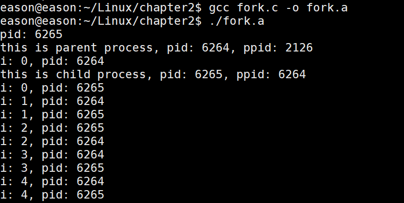
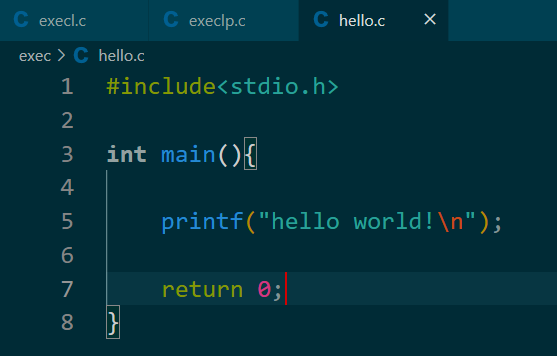
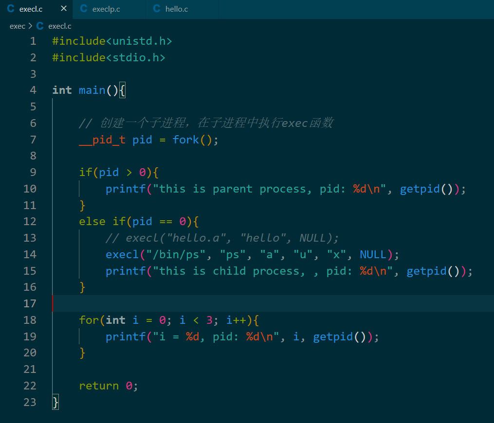
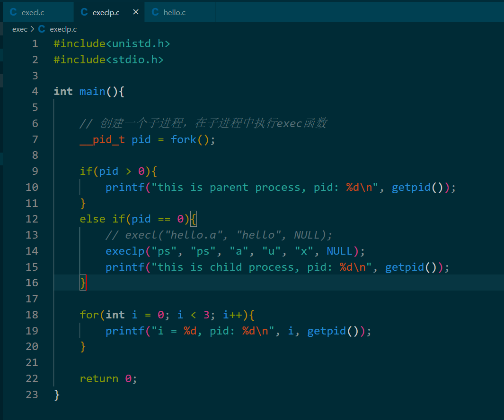
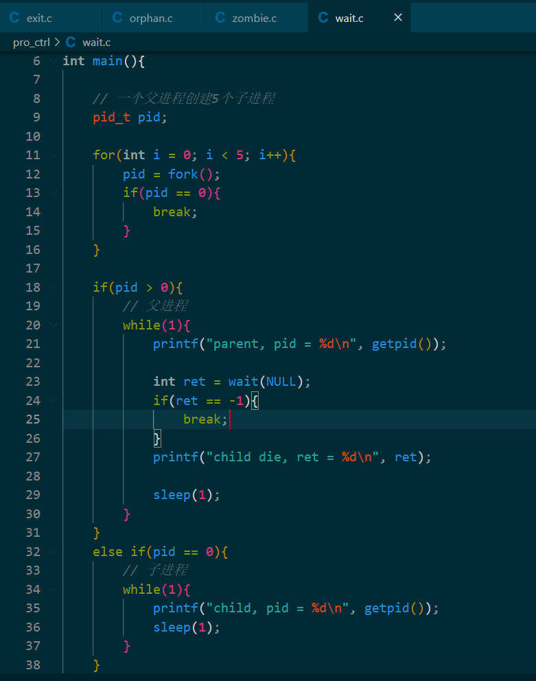

- [进程相关基础知识](#进程相关基础知识)
  - [进程概述](#进程概述)
  - [进程状态转换](#进程状态转换)
    - [进程相关命令](#进程相关命令)
- [进程创建](#进程创建)
  - [fork函数创建子进程](#fork函数创建子进程)
  - [父子进程虚拟空间情况](#父子进程虚拟空间情况)
  - [父子进程关系及GDB多进程调试](#父子进程关系及gdb多进程调试)
    - [父子进程的关系](#父子进程的关系)
    - [GDB多进程调试](#gdb多进程调试)
  - [exec函数族](#exec函数族)
    - [exec函数族作用图解](#exec函数族作用图解)
    - [exec函数族代码演示](#exec函数族代码演示)
- [进程控制](#进程控制)
  - [进程退出](#进程退出)
  - [孤儿进程](#孤儿进程)
  - [僵尸进程](#僵尸进程)
    - [产生原因](#产生原因)
    - [进程回收](#进程回收)
      - [wait](#wait)
      - [waitpid](#waitpid)
- [进程通信](#进程通信)
  - [进程通信简介](#进程通信简介)
  - [匿名管道](#匿名管道)
    - [概述](#概述)
    - [父子进程通过匿名管道通信](#父子进程通过匿名管道通信)
    - [匿名管道通信案例](#匿名管道通信案例)
    - [管道读写特点](#管道读写特点)
    - [管道设置非阻塞](#管道设置非阻塞)
  - [有名管道](#有名管道)
    - [介绍和使用](#介绍和使用)
    - [有名管道实现简单版聊天功能](#有名管道实现简单版聊天功能)
      - [最简单的实现](#最简单的实现)
  - [内存映射](#内存映射)
    - [介绍](#介绍)
    - [代码实现](#代码实现)
      - [有关系的进程（父子进程）](#有关系的进程父子进程)
      - [没有关系的进程间通信](#没有关系的进程间通信)
    - [思考问题](#思考问题)
    - [使用内存映射完成文件复制](#使用内存映射完成文件复制)
    - [mmap实现匿名映射](#mmap实现匿名映射)
  - [信号](#信号)
    - [信号概述](#信号概述)
  - [信号相关函数](#信号相关函数)
  - [信号捕抓函数](#信号捕抓函数)
    - [signal](#signal)
    - [信号集及其相关函数](#信号集及其相关函数)
    - [sigaction](#sigaction)
    - [内核实现信号捕抓的过程](#内核实现信号捕抓的过程)
    - [SIGCHLD信号](#sigchld信号)
  - [共享内存](#共享内存)
  - [守护进程](#守护进程)


# 进程相关基础知识


## 进程概述
讲得都是操作系统的知识，略。


## 进程状态转换
基础知识部分操作系统有，略。  


### 进程相关命令
- 查看进程
    - ps aux/ajx  可通过 man ps 查询
    - a：显示终端上所有进程，包括其他用户的进程
    - u：显示进程的详细信息
    - x：显示没有控制终端的进程
    - j：列出与作业控制相关的信息

- stat参数意义：可以查看man文档，因为参数过多所以不写了；可通过 man stat 查询   

- 实时显示进程状态：top  可通过 man top 查询 
    - 可以加上 -d 指定信息更新的间隔
    - 在top命令执行后，可以按以下按键对显示结果排序：
        - M：根据内存使用量排序
        - P：CPU占有率
        - T：进程运行时间长短
        - U：根据用户名筛选进程
        - K：输入指定PID杀死进程

- kill：杀死进程，可通过 man kill 查询 
    - kill -l 列出所有信号
    - kill -9 PID 强制杀死进程

- 进程号及进程组相关函数
  - pid_t getpid(void)
  - pid_t getppid(void)
  - pid_t getpgid(pid_t pid)


# 进程创建


## fork函数创建子进程

进程创建函数
- pid_t fork(void)  可以通过 man 2 fork 查询
    - return value:
        - 成功：返回两次值：子进程中返回0，父进程中返回子进程ID
        - 失败：返回-1
    - 失败的两个主要原因：
        - 当前系统进程数达到上限，此时error的值被设置为 EAGAIN
        - 系统内存不足，这是error的值被设置为 ENOMEM
- getpid() 获取子进程pid
- getppid()  获取父进程ppid  

执行过程说明：   


输出结果：   
   

fork后，父子进程的用户区数据是一样的：    
  


## 父子进程虚拟空间情况   
通过代码说明问题：   
   

输出结果如下：   
   

这是因为fork使用的是 **读时共享，写时拷贝**   
   

过程描述如下：
- 当调用fork拷贝的时候，还没有对用户区的数据进行修改之前，子进程和父进程是共享同一个用户区的，这体现了读时共享，如图所示：
   

- 当父进程需要修改用户区数据时，这个时候就会把父进程的用户区复制一份给子进程，同时执行的实际物理地址也不一样了，如图：  
      

为什么采用 **读时共享，写时拷贝** ？   
因为拷贝父进程用户区的数据是需要时间和内存的，但是在只读的情况下，共享一份内存是不影响操作的效果的；而且并不是所有的父子进程都要进行写数据，在这种情况下如果fork就马上拷贝用户区数据，将浪费时间和内存，影响操作系统效率。   
写数据的时候，要求父子进程之间是互不干扰的，所以要拷贝一份数据给子进程。   
给我的感觉就是读时浅拷贝，一旦涉及写操作就要深拷贝。  


## 父子进程关系及GDB多进程调试


### 父子进程的关系
- 区别
    - fork函数返回值不同
        - 父进程中返回子进程的id，所以 >0
        - 子进程中 =0
    - PCB中的数据
        - 当前进程的id pid 
        - 当前进程的父进程的id pid
        - 信号集
   
- 共同点
    - 子进程创建出来还没有执行写操作时，父子进程用户区的数据以及文件描述符表一样


### GDB多进程调试   
注意，在使用GDB进行调试的时候，GDB默认只能跟踪一个进程，所以可以在调试前通过设置GDB调试工具跟踪父进程或子进程，默认是跟踪父进程。   
```shell
设置调试父进程或子进程:
set follow-fork-mode [parent（默认）| child]
```   

```
设置调试模式：
set detach-on-fork [on | off]
设置为on时，表示调试当前进程时，其他进程继续运行；若为off，调试当前进程时其他进程挂起。
```

- 查看调试的进程： info inferiors
- 切换当前调试的进程： inferior id
- 使进程脱离gdb调试： detach inferior id   


## exec函数族


### exec函数族作用图解
- 进程调用exec函数，函数里面的参数是 a.out 。图示是开始时进程和可执行文件 a.out 的虚拟内存空间情况   
   

- 调用的时候，a.out 可执行程序的虚拟内存空间会替换掉进程的用户区数据，如图所示，这样的话进程执行的就是 a.out 而不是用来的用户区里面的进程了   
   


### exec函数族代码演示
函数族包含函数，不用记，要用了可以用 man 3 xxx 查，只有最后一个才用 man 2 xxx 查，因为它是Linux库函数：   
     

创建 hello.c 函数文件：   
   

execl函数演示：   
- 建立execl.c文件：   
   
- 执行结果如下，可以发现子进程只执行了execl这个函数，它原来的printf语句和for循环都没有执行：   
   

execlp函数演示：
- 建立execlp.c文件：   
   
- 执行结果和上面一样，这里只是用来说明这两个函数的一个区别：execl函数一定要指名绝对路径，但是execlp不用，因为它会自己去环境变量里面找。   


# 进程控制   


## 进程退出
可以看到，C库的exit函数会比Linux的_exit函数多做两步，因为C库的I/O函数是有缓冲区的，但是底层还是调用的Linux的_exit函数。   
   

以下说明两个函数区别：
C库的exit函数
- 建立exit文件   
   
- 编译输出
   

Linux的_exit函数
- 建立exit文件    
   
- 编译输出   
   

可以发现，C库的exit.c文件有输出world，但是Linux的没有输出world，原因如下：
- 语句 printf 先是把 hello 输入到缓冲区， \n  可以刷新缓冲区实现输出，所以两个函数都会输出 hello
- 此时 printf 再把 world 输入到缓冲区，但是后面没有跟 \n ，所以不会自动刷新缓冲区，而因为C库的 exit() 函数会刷新I/O缓冲区，所以第一个文件会输出 world ；以此类推，第二个文件没有输出 world，world还停留在缓冲区


## 孤儿进程
定义：
- 父进程运行结束时，子进程还在运行，这样的 **子进程** 就是孤儿进程
- 因为父进程是有义务回收子进程的资源的，但是此时父进程已经运行结束了。所以每当出现一个孤儿进程时，内核就会把孤儿进程的父进程设置为 init ，init 进程就会循环地 wait() 孤儿进程的退出
- 所以孤儿进程不会有什么危害

代码如下：   
   

没有执行sleep时，可以看到子进程是有父进程的id的：   
   

执行sleep后，子进程没有父进程的id，而且子进程的输出已经回到前台了，也就是 eason@eason:~/Linux/chapter2/pro_ctrl$。因为经过5s的休眠后，父进程已经运行结束了。结果如图：   
    


## 僵尸进程


### 产生原因
- 每个进程结束之后，都会释放自己地址空间中的用户区数据，内核区的PCB没有办法自己释放，需要父进程去释放
- 一个进程通过fork进程创建子进程，如果子进程退出，而父进程没有调用wait()/waitpid()获取子进程的状态信息，那么子进程的PCB仍然保留在系统中，这种进程称为僵尸进程
- 僵尸进程不可以被 kill -9 杀死
- 这样会导致一个问题：如果子进程的PCB一直没有得到释放，那么它的进程号就会一直被占用，但是系统所能够用的进程号是有限的，如果产生大量的僵尸进程，将因为没有可用的进程号而导致系统不能产生新的进程   

通过以下代码可以产生僵尸进程，因为父进程一直在执行，但是子进程已经结束了，但它的PCB得不到释放：   
    


### 进程回收
介绍：
- 父进程可以通过调用 wait()/waitpid()获取子进程的状态信息，同时彻底清除这个进程
- wait()/waitpid()这两个函数功能一样，区别在于wait函数会阻塞，而waitpid可以设置不阻塞
- 一次wait()/waitpid()只能清理一个子进程   
- 这两个函数可以通过 man 2 xxx 查询   


#### wait
通过以下代码可以体现出wait会阻塞，一次wait只能清除一个子进程，而且可以通过kill -9杀死子进程并返回进程号：   
   

还可以往代码里面添加如下宏查看退出信息：   
   


#### waitpid
主要讲了这个函数如何使用，可以查看文档 man 2 xxx


# 进程通信   


## 进程通信简介
课程按照下面图展开介绍：      
     


## 匿名管道


### 概述
命令 ls | wc -l 中的 | 就是管道，具体过程可以看下面图示。ls和wc都是进程，其中wc进程执行的时候需要获取进程ls的输出，但是进程之间是不可以直接访问的，所以就需要管道的介入。   
      

管道特点：   
     

     

**为什么可以使用管道进行进程间通信？这里听不懂，老师说是因为他们分享共同的文件描述符**      
   

管道数据结构：   
   


### 父子进程通过匿名管道通信
首先了解下匿名管道的使用，详细可以查看官方文档：   
     

实现代码如下：   
    

输出结果如下：   
      


### 匿名管道通信案例
实现 ps aux | grep xxx，详见以下代码实现：   
```
/*
实现ps aux | grep xxx 实现父子进程通信

子进程：ps aux，子进程结束后，将数据发送给父进程
父进程：获取到数据，过滤

pipe()
execlp()
子进程将标准输出 stdout_fileno 重定向到管道的写端 dup2
*/
#include<unistd.h>
#include<stdlib.h>
#include<stdio.h>
#include<string.h>
#include<sys/types.h>
#include<wait.h>


int main(){

    // 创建一个管带
    int fd[2];
    int ret = pipe(fd);

    if(ret == -1){
        perror("pipe");
        exit(0);
    }

    // 创建子进程
    pid_t pid = fork();

    if(pid > 0){
        // 父进程
        // 关闭写端
        close(fd[1]);
        // 从管道中读取数据
        char buf[1024] = {0};
        int len = -1;
        // 输出
        while(len = read(fd[0], buf, sizeof(buf) - 1) > 0){
            printf("%s", buf);
            memset(buf, 0, 1024);
        }     
        wait(NULL);   
    }
    else if(pid == 0){
        // 子进程
        // 关闭读端
        close(fd[0]);
        // 文件描述符重定向 stdout_fileno -> fd[1]
        dup2(fd[1], STDOUT_FILENO);
        // 执行ps aux
        execlp("ps", "ps", "aux", NULL);
        perror("execlp");
        exit(0);
    }
    else{
        perror("fork");
        exit(0);
    }

    return 0;
}
```   


### 管道读写特点   
- 读管道
    - 管道中有数据，read返回实际读到的字节数
    - 管道中无数据
        - 写端完全关闭，read返回0（相当于读到文件末尾）
        - 写端没有完全关闭，read阻塞等待
- 写管道
    - 管道读端全部关闭，进程异常终止（进程收到SIGPIPE信号）
    - 管道读端没有全部关闭
        - 管道已满，write阻塞
        - 管道没有满，write将数据写入，并返回实际写入字节数  


### 管道设置非阻塞
详见代码：    
```
#include<unistd.h>
#include<stdlib.h>
#include<stdio.h>
#include<string.h>
#include<sys/types.h>
#include<fcntl.h>

/*
设置管道非阻塞
int flags = fcntl(fd[0], F_GETFL);  // 获取原来的flag
flags |= O_NOBLOCK;    // 修改flag
fcntl(fd[0], F_SETFL, flags);  // 设置新的flag
*/

int main(){

    // 实现子进程向父进程发送数据
    // 在fork之前创建管道
    int pipefd[2];
    int ret = pipe(pipefd);
    if(ret == -1){
        perror("pipe");
        exit(0);
    }

    // 创建子进程
    pid_t pid = fork();
    if(pid > 0){
        // 父进程从管道读数据
        printf("this is a parent process, pid = %d!\n", getpid());
        char buf[1024] = {0};


        int flags = fcntl(pipefd[0], F_GETFL);
        flags |= O_NONBLOCK;
        fcntl(pipefd[0], F_SETFL, flags);


        while(1){
            int len = read(pipefd[0], buf, sizeof(buf));
            printf("%d\n", len);
            printf("parent recv: %s, pid: %d\n", buf, getpid());
            memset(buf, 0, sizeof(buf));
            sleep(2);
        }
    }
    else if(pid == 0){
        // 子进程从管道写数据
        printf("this is a child process, pid = %d!\n", getpid());
        char buf[1024] = {0};
        while(1){
            char* str = "hi, this is a child process!\n";
            write(pipefd[1], str, strlen(str));
            sleep(6);
        }
    }

    return 0;
}
```   

输出结果如下：   
   


## 有名管道   


### 介绍和使用   
    

FIFO和pipe区别：   
   

FIFO使用：   
   

具体使用参考下面三个代码和管道读写特点去理解：
```
mkfifo.c
// 创建管道
#include<stdio.h>
#include<stdlib.h>
#include<unistd.h>
#include<sys/types.h>
#include<sys/stat.h>


int main(){

    int exist = access("fifo1", F_OK);
    if(exist == 0){
        printf("file exists!\n");
        exit(0);
    }

    int ret = mkfifo("fifo1", 0664);

    if(ret == -1){
        perror("mkfifo");
        exit(0);
    }

    return 0;
}
```
   

```
write.c
// 往管道里面写数据
#include<stdio.h>
#include<stdlib.h>
#include<string.h>
#include<unistd.h>
#include<fcntl.h>
#include<sys/types.h>
#include<sys/stat.h>


int main(){

    // 判断管道文件是否存在
    int exist = access("fifo1", F_OK);
    if(exist == -1){
        // 不存在
        printf("file does not exist!\n");

        int ret = mkfifo("fifo1", 0664);
        if(ret == -1){
            perror("mkfifo");
            exit(0);
        }
    }

    // 以只写打开管道
    int fd = open("fifo1", O_WRONLY);
    if(fd == -1){
        perror("open");
        exit(0);
    }

    // 写数据
    for(int i = 0; i < 100; i++){
        char buf[1024];
        sprintf(buf, "hello, %d\n", i);
        printf("write data: %s\n", buf);
        write(fd, buf, strlen(buf));
        sleep(1);
    }

    close(fd);

    return 0;
}

```
   

```
read.c
// 往管道里面读数据
#include<stdio.h>
#include<stdlib.h>
#include<unistd.h>
#include<fcntl.h>
#include<sys/types.h>
#include<sys/stat.h>

int main(){

    // 以只读方式打开管道文件
    int fd = open("fifo1", O_RDONLY);
    if(fd == -1){
        perror("open");
        exit(0);
    }

    // 读数据
    while(1){
        char buf[1024] = {0};
        int len = read(fd, buf, sizeof(buf));
        if(len == 0){
            printf("read all!\n");
            break;;
        }
        printf("recv buf: %s\n", buf);
    }

    close(fd);

    return 0;
}
```


### 有名管道实现简单版聊天功能


#### 最简单的实现
进程A给进程B发送一行，进程B接收到数据后再给进程A发送一行，如图：   
   

代码如下：   
```
// chatA.c
#include<stdio.h>
#include<stdlib.h>
#include<unistd.h>
#include<fcntl.h>
#include<sys/types.h>
#include<sys/stat.h>
#include<string.h>

int main(){

    // 判断管道是否存在
    int ret = access("fifo1", F_OK);
    if(ret == -1){
        printf("fifo1 does not exist, should be built!\n");
        ret = mkfifo("fifo1", 0664);
        if(ret == -1){
            perror("mkfifo");
            exit(0);
        }
    }

    ret = access("fifo2", F_OK);
    if(ret == -1){
        printf("fifo2 does not exist, should be built!\n");
        ret = mkfifo("fifo2", 0664);
        if(ret == -1){
            perror("mkfifo");
            exit(0);
        }
    }

    // 以只读方式打开管道1
    int fdr = open("fifo1", O_RDONLY);
    if(fdr == -1){
        perror("open");
        exit(0);
    }
    printf("open fifo1 successfully, wait for reading...\n");

    // 以只写方式打开管道2
    int fdw = open("fifo2", O_WRONLY);
    if(fdw == -1){
        perror("open");
        exit(0);
    }
    printf("open fifo2 successfully, wait for writing...\n");

    // 循环读写数据
    char buf[128];
    while(1){

        // 读数据
        memset(buf, 0, 128);
        ret = read(fdr, buf, 128);
        if(ret <= 0){
            perror("read");
            break;;
        }
        printf("buf: %s\n", buf);

        memset(buf, 0, 128);
        // 获取标准输入的数据
        fgets(buf, 128, stdin);

        // 写数据
        ret = write(fdw, buf, strlen(buf));
        if(ret == -1){
            perror("write");
            exit(0);
        }

        
    }

    // 关闭文件
    close(fdw);
    close(fdr);

    return 0;
}
```

```
// chatB.c
#include<stdio.h>
#include<stdlib.h>
#include<unistd.h>
#include<fcntl.h>
#include<sys/types.h>
#include<sys/stat.h>
#include<string.h>

int main(){

    // 判断管道是否存在
    int ret = access("fifo1", F_OK);
    if(ret == -1){
        printf("fifo1 does not exist, should be built!\n");
        ret = mkfifo("fifo1", 0664);
        if(ret == -1){
            perror("mkfifo");
            exit(0);
        }
    }

    ret = access("fifo2", F_OK);
    if(ret == -1){
        printf("fifo2 does not exist, should be built!\n");
        ret = mkfifo("fifo2", 0664);
        if(ret == -1){
            perror("mkfifo");
            exit(0);
        }
    }

    // 以只读方式打开管道1
    int fdr = open("fifo1", O_RDONLY);
    if(fdr == -1){
        perror("open");
        exit(0);
    }
    printf("open fifo1 successfully, wait for reading...\n");

    // 以只写方式打开管道2
    int fdw = open("fifo2", O_WRONLY);
    if(fdw == -1){
        perror("open");
        exit(0);
    }
    printf("open fifo2 successfully, wait for writing...\n");

    // 循环读写数据
    char buf[128];
    while(1){

        // 读数据
        memset(buf, 0, 128);
        ret = read(fdr, buf, 128);
        if(ret <= 0){
            perror("read");
            break;;
        }
        printf("buf: %s\n", buf);

        memset(buf, 0, 128);
        // 获取标准输入的数据
        fgets(buf, 128, stdin);

        // 写数据
        ret = write(fdw, buf, strlen(buf));
        if(ret == -1){
            perror("write");
            exit(0);
        }

        
    }

    // 关闭文件
    close(fdw);
    close(fdr);

    return 0;
}
```   


## 内存映射


### 介绍
如下图所示：   
   
有两个进程1和2，图示是它们的虚拟内存空间。它们同时打开了磁盘中的文件，映射到了它们的虚拟内存空间中。通过这个手段，当进程1修改文件数据时，进程2也可以同步读取到文件的改变，从而实现进程间通信。   

相关系统调用，具体可查看官方文档：   
- mmap
- munmap


### 代码实现


#### 有关系的进程（父子进程）

步骤如下：   
- 还没有子进程的时候
    - 通过唯一的父进程，先创建内存映射区
- 有了内存映射区以后，创建子进程
- 父子进程共享创建的内存映射区
- 注意，内存映射区通信是非阻塞的

代码如下：
```
#include<stdio.h>
#include<stdlib.h>
#include<unistd.h>
#include<fcntl.h>
#include<string.h>
#include<wait.h>
#include<sys/types.h>
#include<sys/mman.h>


int main(){

    // 打开一个文件
    int fd = open("test.txt", O_RDWR);

    // 判断是否打开成功
    if(fd == -1){
        perror("open");
        exit(0);
    }

    // 获取文件大小
    int size = lseek(fd, 0, SEEK_END);

    // 创建文件映射区
    void* ptr = mmap(NULL, size, PROT_READ | PROT_WRITE, MAP_SHARED, fd, 0);
    if(ptr == MAP_FAILED){
        perror("mmap");
        exit(0);
    }

    // 创建子进程
    pid_t pid = fork();
    if(pid > 0){
        // 父进程
        wait(NULL);
        char buf[64];
        strcpy(buf, (char*) ptr);
        printf("read data: %s\n", buf);
    }
    else if(pid == 0){
        // 子进程
        strcpy((char*) ptr, "hello, son!\n");        
    }

    // 关闭内存映射区
    munmap(ptr, size);

    return 0;
}
```

所创建的test.txt文件如图所示：   
   

代码运行效果：   
   

test.txt运行后：   
   


#### 没有关系的进程间通信
步骤如下：   
- 准备一个大小不是0的磁盘文件
- 进程1 通过磁盘文件创建内存映射区
    - 得到一个操作这块内存的指针
- 进程2 通过磁盘文件创建内存映射区
    - 得到一个操作这块内存的指针
- 使用内存映射区通信   

代码如下：   
```
// 这个进程负责往映射区写入数据
#include<stdio.h>
#include<stdlib.h>
#include<unistd.h>
#include<fcntl.h>
#include<string.h>
#include<wait.h>
#include<sys/types.h>
#include<sys/mman.h>

int main(){

    int fd = open("test1.txt", O_RDWR);
    if(fd == -1){
        perror("open");
        exit(0);
    }
    int size = lseek(fd, 0, SEEK_END);

    void* ptr = mmap(NULL, size, PROT_READ | PROT_WRITE, MAP_SHARED, fd, 0);
    if(ptr == MAP_FAILED){
        perror("mmap");
        exit(0);
    }

    strcpy((char*) ptr, "hello, this is write pro!\n");

    return 0;
}
```  

```
// 这个进程负责读取映射区的数据，并取消映射
#include<stdio.h>
#include<stdlib.h>
#include<unistd.h>
#include<fcntl.h>
#include<string.h>
#include<wait.h>
#include<sys/types.h>
#include<sys/mman.h>

int main(){

    int fd = open("test1.txt", O_RDWR);
    if(fd == -1){
        perror("open");
        exit(0);
    }
    int size = lseek(fd, 0, SEEK_END);

    void* ptr = mmap(NULL, size, PROT_READ | PROT_WRITE, MAP_SHARED, fd, 0);
    if(ptr == MAP_FAILED){
        perror("mmap");
        exit(0);
    }

    char buf[64];
    strcpy(buf, (char*) ptr);
    printf("read data: %s\n", buf);

    munmap(ptr, size);

    return 0;
}
```

所创建的test1.txt文件如图所示:   
   

代码运行结果：   
   

运行后test1.txt：   
   


### 思考问题
1. 如果对mmap返回值(ptr)做++操作(ptr++)， munmap是否能成功？   
从问题可知的确可以对ptr做++操作，但是munmap就不能成功了，因为munmap取消内存映射的时候是要从映射的首地址开始取消的，经过++操作后，ptr指向的已经不是映射的首地址了。   

2. 如果open时传入参数为O_RDONLY, mmap时prot参数指定PROT_READ | PROT_WRITE会怎样？   
错误，返回MAP_FAILED。因为open()函数中的权限建议和prot参数的权限保持一致，更具体地说，mmap的prot参数指定的权限要小于等于open传入的文件操作权限。   

3. 如果文件偏移量为1000会怎样？   
偏移量必须是4K的整数倍，返回MAP_FAILED。为什么是4k，因为Linux里面一个页的大小是4k（随着系统不一样而不一样）。所以传入的length如果不到4k，也就是1个页面大小，其实会按一个页面的大小分配。   

4. mmap什么情况下会调用失败？   
    - 第二个参数 length = 0
    - 第三个参数Port：
        - 只有写权限的时候会失败，因为建立了内存映射后，先要读取到内存映射的数据才可以写
        - mmap的prot参数指定的权限大于open传入的文件操作权限
    - 等等   
   
5. 可以open的时候通过O_CREAT创建一个新文件，来作为创建映射区的磁盘文件吗？   
可以的，但是创建的文件的大小如果为0的话，肯定不行。这个时候可以对新的文件进行扩展，通过lseek()、truncate()等系统调用。   

6. mmap后关闭文件描述符，对mmap映射有没有影响？   
    int fd = open("XXX");   
    mmap(,,,,fd,0);   
    close(fd);    
    映射区还存在，创建映射区的fd被关闭，没有任何影响，因为mmap相当于对传入的fd进行了拷贝。    

7. 对ptr越界操作会怎样？   
越界操作操作的是非法的内存 -> 段错误


### 使用内存映射完成文件复制
原理如下图所示：   
   
假设存在两个文件a.txt和copy.txt，他们均和内存建立了映射，这个时候只要操作内存把a.txt的数据复制到copy.txt的映射区域就可以完成内存复制。   

思路：
1. 对原始的文件进行内存映射   
2. 创建一个新文件（拓展该文件)   
3. 把新文件的数据映射到内存中   
4. 通过内存拷贝将第一个文件的内存数据拷贝到新的文件内存中   
5. 释放资源   
  
代码如下：   
```
#include<stdio.h>
#include<stdlib.h>
#include<unistd.h>
#include<fcntl.h>
#include<string.h>
#include<wait.h>
#include<sys/types.h>
#include<sys/mman.h>

int main(){

    // 对原始的文件进行内存映射
    int fd = open("english.txt", O_RDWR);
    if(fd == -1){
        perror("open");
        exit(0);
    }    

    // 创建一个新文件
    int fd1 = open("cpy.txt", O_RDWR | O_CREAT, 0664);
    if(fd1 == -1){
        perror("open");
        exit(0);
    }

    // 拓展该文件
    int size = lseek(fd, 0, SEEK_END);
    truncate("cpy.txt", size);

    // 把文件的数据映射到内存中
    void* ptr = mmap(NULL, size, PROT_READ | PROT_WRITE, MAP_SHARED, fd, 0);
    void* ptr1 = mmap(NULL, size, PROT_READ | PROT_WRITE, MAP_SHARED, fd1, 0);

    if(ptr == MAP_FAILED){
        perror("mmap");
        exit(0);
    }

    if(ptr1 == MAP_FAILED){
        perror("mmap");
        exit(0);
    }

    // 通过内存拷贝将第一个文件的内存数据拷贝到新的文件内存中
    memcpy(ptr1, ptr, size);

    // 释放资源
    /*
    这里需要注意，先创建的后释放，后创建的先释放，因为后创建的资源可能对先创建的资源有依赖关系
    */
    munmap(ptr1, size);
    munmap(ptr, size);

    close(fd1);
    close(fd);

    return 0;
}
```   


### mmap实现匿名映射
代码如下：   
```
// 匿名映射：不需要文件实体进行内存映射
#include<stdio.h>
#include<stdlib.h>
#include<unistd.h>
#include<fcntl.h>
#include<string.h>
#include<wait.h>
#include<sys/types.h>
#include<sys/mman.h>

int main(){

    // 创建匿名映射区
    int len = 4096;
    void* ptr = mmap(NULL, len, PROT_READ | PROT_WRITE, MAP_SHARED | MAP_ANONYMOUS, -1, 0);

    if(ptr == MAP_FAILED){
        perror("mmap");
        exit(0);
    }

    // 父子进程间通信
    pid_t pid = fork();

    if(pid > 0){
        strcpy((char*) ptr, "hello");
        wait(NULL);
    }
    else if(pid == 0){
        sleep(1);
        printf("%s\n", (char*) ptr);
    }

    // 释放资源
    int ret = munmap(ptr, len);
    if(ret == -1){
        perror("munmap");
        exit(0);
    }

    return 0;
}
```


## 信号


### 信号概述
   
   
   
简单是指使用简单，并不代表实现简单；不能携带大量信息，但是仍然可以实现进程间通信。   

Linux信号一览表：   
   
   
   
   
    
信号的5种默认处理动作：   
     


## 信号相关函数   
kill、raise、abort、alarm、setitimer，详见官方文档，不多bb。


## 信号捕抓函数


### signal
和上一小节中的alarm、setitimer一起使用。   
介绍详见官方文档，实现如下：   
```
// signal.c
#include<stdio.h>
#include<stdlib.h>
#include<sys/time.h>
#include<signal.h>

void myalarm(int num){
    printf("num is %d\n", num);
    printf("******\n");
}

// 过三秒以后，每个两秒钟定时一次
int main(){

    // 注册信号捕抓
    // signal(SIGALRM, SIG_IGN);
    // signal(SIGALRM, SIG_DFL);
    signal(SIGALRM, myalarm);

    struct itimerval new_value;

    // 设置间隔的时间
    new_value.it_interval.tv_sec = 2;
    new_value.it_interval.tv_usec = 0;

    // 设置延迟的时间，3秒后开始第一次定时
    new_value.it_value.tv_sec = 3;
    new_value.it_value.tv_usec = 0;

    int ret = setitimer(ITIMER_REAL, &new_value, NULL);
    printf("start!\n");

    if(ret == -1){
        perror("setitimer");
        exit(0);
    }

    getchar();

    return 0;
}
```   


### 信号集及其相关函数   
信号集   
注意未决信号集不可以修改，只可以获取；而阻塞信号集即可以修改也可以获取。   
    
 
工作过程：   
   

图示：   


信号集相关函数，不多bb，自己看官方文档：  
   


### sigaction
见官方文档


### 内核实现信号捕抓的过程
如下图，有点像中断处理过程：   
  


### SIGCHLD信号
    

所以可以通过这个信号解决僵尸进程问题，代码看不太懂：   
```
/*
    SIGCHLD信号产生的3个条件：
        1.子进程结束
        2.子进程暂停了
        3.子进程继续运行
        都会给父进程发送该信号，父进程默认忽略该信号。
    
    使用SIGCHLD信号解决僵尸进程的问题。
*/

#include <stdio.h>
#include <unistd.h>
#include <sys/types.h>
#include <sys/stat.h>
#include <signal.h>
#include <sys/wait.h>

void myFun(int num) {
    printf("捕捉到的信号 ：%d\n", num);
    // 回收子进程PCB的资源
    // while(1) {
    //     wait(NULL); 
    // }
    while(1) {
       int ret = waitpid(-1, NULL, WNOHANG);
       if(ret > 0) {
           printf("child die , pid = %d\n", ret);
       } else if(ret == 0) {
           // 说明还有子进程活着
           break;
       } else if(ret == -1) {
           // 没有子进程
           break;
       }
    }
}

int main() {

    // 提前设置好阻塞信号集，阻塞SIGCHLD，因为有可能子进程很快结束，父进程还没有注册完信号捕捉
    sigset_t set;
    sigemptyset(&set);
    sigaddset(&set, SIGCHLD);
    sigprocmask(SIG_BLOCK, &set, NULL);

    // 创建一些子进程
    pid_t pid;
    for(int i = 0; i < 20; i++) {
        pid = fork();
        if(pid == 0) {
            break;
        }
    }

    if(pid > 0) {
        // 父进程

        // 捕捉子进程死亡时发送的SIGCHLD信号
        struct sigaction act;
        act.sa_flags = 0;
        act.sa_handler = myFun;
        sigemptyset(&act.sa_mask);
        sigaction(SIGCHLD, &act, NULL);

        // 注册完信号捕捉以后，解除阻塞
        sigprocmask(SIG_UNBLOCK, &set, NULL);

        while(1) {
            printf("parent process pid : %d\n", getpid());
            sleep(2);
        }
    } else if( pid == 0) {
        // 子进程
        printf("child process pid : %d\n", getpid());
    }

    return 0;
}
```   


## 共享内存
效率最高的一种进程间通信方式，这部分介绍内容和操作系统中的描述十分相似：      
   

共享内存使用步骤，这几个函数可以查看官方文档：   
   

共享内存操作函数，详见官方文档：   
   

操作演示：   
```
// write_shm.c
#include<stdio.h>
#include<string.h>
#include<sys/ipc.h>
#include<sys/shm.h>

int main(){

    // 创建一个共享内存
    int shmid = shmget(100, 4096, IPC_CREAT | 0664);
    printf("shmid: %d\n", shmid);

    // 和当前进程进行关联
    void* ptr = shmat(shmid, NULL, 0);

    char* str = "hello";

    // 写数据
    memcpy(ptr, str, strlen(str) + 1);

    printf("按任意键继续\n");
    getchar();

    // 解除关联
    shmdt(ptr);

    // 删除共享内存
    shmctl(shmid, IPC_RMID, NULL);

    return 0;
}
```   

```
// read_shm.c
#include<stdio.h>
#include<string.h>
#include<sys/ipc.h>
#include<sys/shm.h>


int main(){

    // 获取一个共享内存
    int shmid = shmget(100, 0, IPC_CREAT);
    printf("shmid: %d\n", shmid);

    // 和当前进程进行关联
    void* ptr = shmat(shmid, NULL, 0);

    // 读数据
    printf("%s\n", (char*)ptr);
    
    printf("按任意键继续\n");
    getchar();

    // 解除关联
    shmdt(ptr);

    // 删除共享内存
    shmctl(shmid, IPC_RMID, NULL);

    return 0;
}
```

问题：   
- 操作系统如何知道一块共享内存被多少个进程关联？   
共享内存维护了一个结构体struct shmid_ds，这个结构体中有一个成员shm_nattach，它记录了关联的进程的个数，可以通过man 2 shmctl查看。   
- 能否对共享内存进行多次删除操作shmctl？   
是可以的，因为shmctl标记删除共享内存，不是直接删除。当和共享内存关联的进程数为0时，共享内存才被真正删除。当共享内存key为0时，表示共享内存被标记删除。   
   

共享内存操作命令：   
   
   
共享内存和内存映射区别：   
- 共享内存可以直接创建，内存映射需要磁盘文件，匿名映射除外
- 共享内存效率更高
- 共享内存所有进程共用一块内存，内存映射则是每个进程在自己的虚拟地址空间中有一个独立的内存
- 数据安全
    - 进程突然退出：共享内存还存在，内存映射区消失
    - 运行中电脑死机了：共享内存的数据存在于内存中，所以会消失；内存映射的数据存放在磁盘中，所以会继续存在
- 生命周期
    - 共享内存：进程退出，共享内存还在，可以通过标记删除（所有关联进程数为0）或者关机销毁
    - 内存映射区：进程退出，内存映射区销毁


## 守护进程   
区分控制终端、进程组、会话   
   

进程组、会话操作函数，详见官方文档：   
   

守护进程概述：   
   

守护进程创建步骤：    
   

案例：   
```
// daemon.c
// 需求：写一个守护进程，每个2s获取系统时间，把这个时间写入到磁盘文件中
#include<stdio.h>
#include<stdlib.h>
#include<unistd.h>
#include<fcntl.h>
# include<signal.h>
#include<sys/stat.h>
#include<sys/types.h>
#include<sys/time.h>
#include<time.h>
#include<string.h>

void work(int num){
    // 捕获到信号后，获取系统时间，写入磁盘文件
    time_t tm = time(NULL);
    struct tm* loc = localtime(&tm);
    // char buf[1024];
    // sprintf(buf, "%d-%d-%d %d:%d;%d\n", loc->tm_year, loc->tm_mon, loc->tm_mday, 
    // loc->tm_hour, loc->tm_min, loc->tm_sec);    
    // printf("%s\n", buf);
    char* str = asctime(loc);
    int fd = open("time.txt", O_RDWR | O_CREAT | O_APPEND, 0664);
    write(fd, str, strlen(str));
    close(fd);
}

int main(){

    // 1、创建子进程，退出父进程
    /*
    为什么要通过子进程创建会话？
    保证创建会话的进程不是进程组的首进程，以防止冲突。可以通过下图理解。
    */
    pid_t pid = fork();
    if(pid > 0){
        exit(0);
    }

    // 2、将子进程重新创建一个会话
    /*
    为什么要重新创建一个会话？
    因为新的会话会脱离原来的控制终端，就不可以通过键盘和终端产生一些信号去杀死这个会话。
    */
    setsid();

    // 3、设置掩码
    umask(022);

    // 4、更改工作目录
    chdir("/home/eason/Linux/chapter2/pro_com/daemon");

    // 5、关闭、重定向文件描述符
    int fd = open("/dev/null", O_RDWR);
    dup2(fd, STDIN_FILENO);
    dup2(fd, STDOUT_FILENO);
    dup2(fd, STDERR_FILENO);

    // 6、业务逻辑

    // 捕抓定时信号
    struct sigaction act;
    act.sa_flags = 0;
    act.sa_handler = work;
    sigemptyset(&act.sa_mask);
    sigaction(SIGALRM, &act, NULL);

    struct itimerval val;
    val.it_value.tv_sec = 2;
    val.it_value.tv_usec = 0;
    val.it_interval.tv_sec = 2;
    val.it_interval.tv_usec = 0;

    // 创建定时器
    setitimer(ITIMER_REAL, &val, NULL);

    while(1){
        sleep(10);
    }

    return 0;
}
```  

利用子进程而不是父进程创建会话，如下图：当这个父进程为进程组的首进程时，通过它创建一个会话，这个会话的首进程组的id将会是这个父进程的id，会导致两个进程组的id相冲突：新的会话以创建会话的进程ID为会话ID，那新的会话ID也是100，和原来的会话ID100冲突了。   
   

**$\color{red}{总结：这一章挺多地方都听得一头雾水，不懂！}$**


