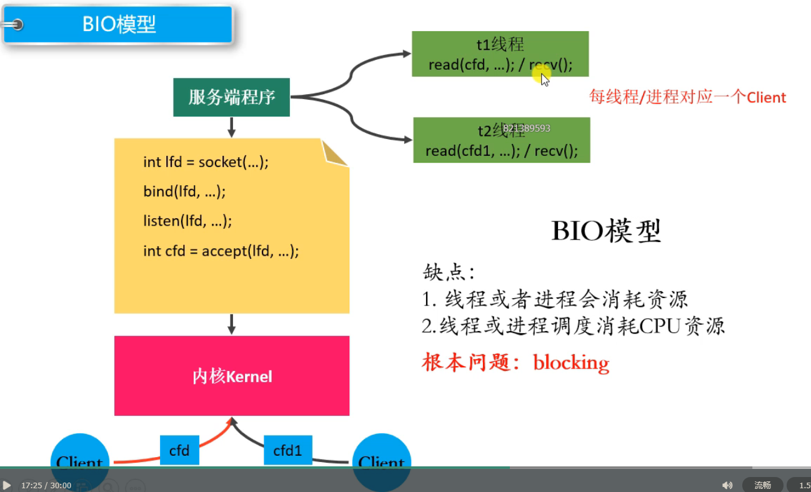
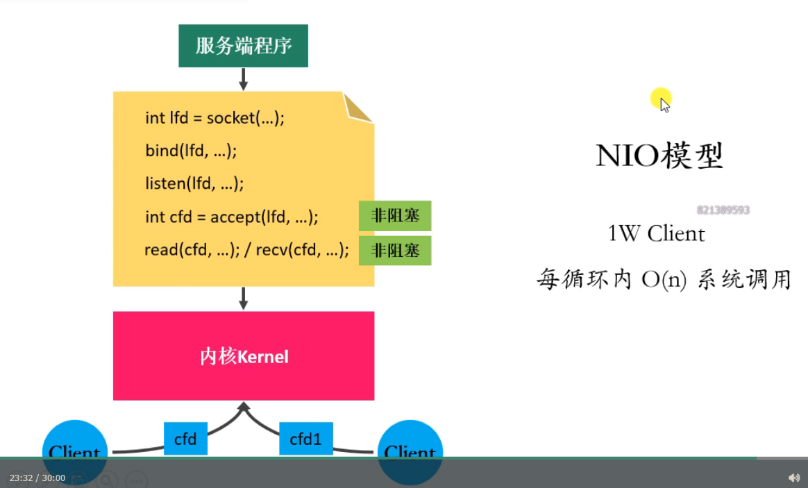
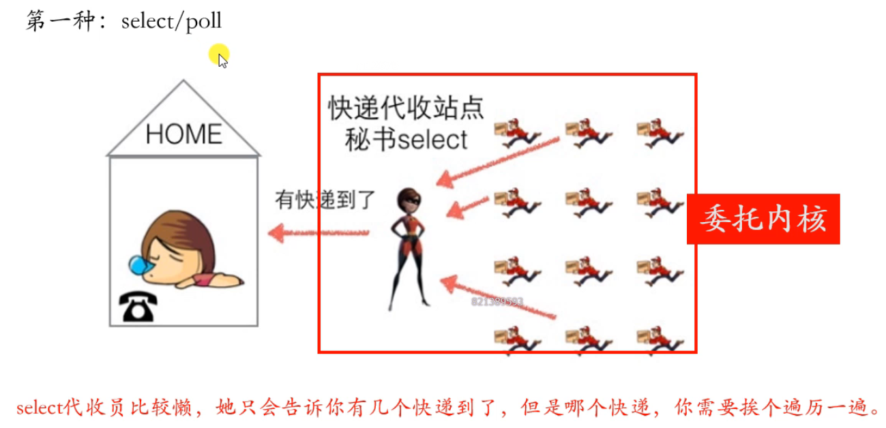
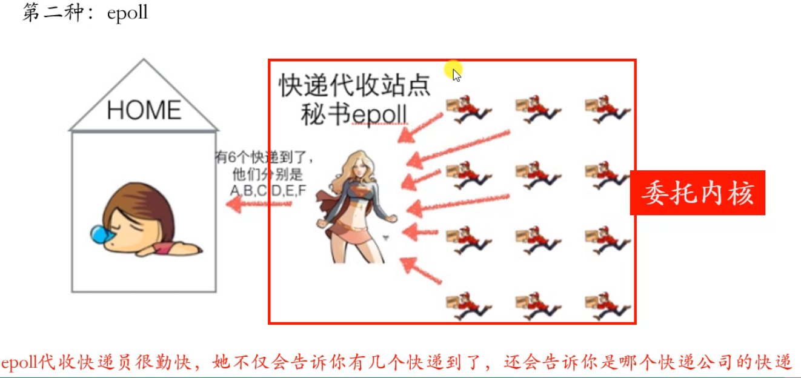
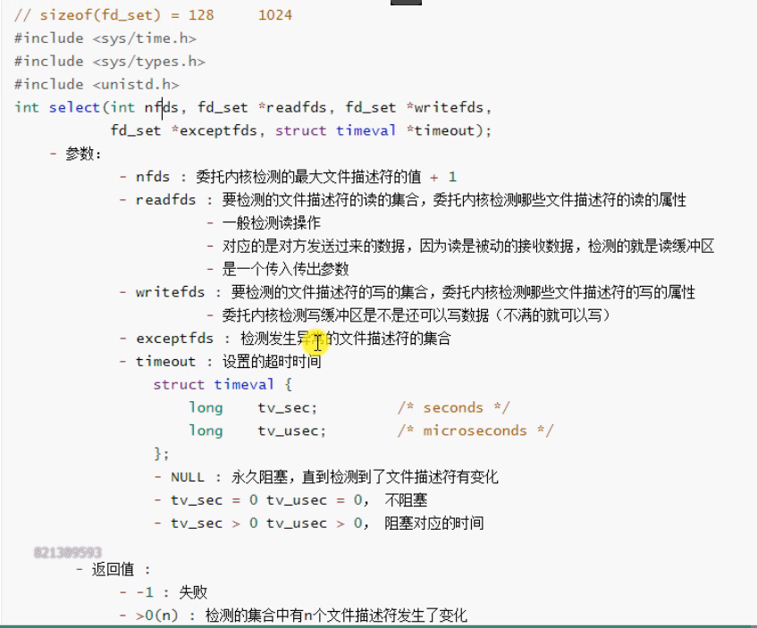
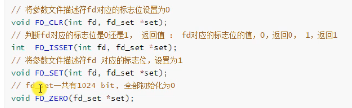

- [网络编程基础知识](#网络编程基础知识)
  - [网络结构](#网络结构)
  - [MAC地址、IP地址、端口](#mac地址ip地址端口)
  - [网络模型](#网络模型)
  - [协议](#协议)
  - [网络通信的过程](#网络通信的过程)
- [socket](#socket)
  - [socket介绍](#socket介绍)
  - [字节序](#字节序)
    - [介绍](#介绍)
    - [字节序转换函数](#字节序转换函数)
  - [socket地址](#socket地址)
  - [IP地址转换](#ip地址转换)
  - [TCP通信流程](#tcp通信流程)
  - [socket函数](#socket函数)
  - [TCP通信实现](#tcp通信实现)
    - [服务器端](#服务器端)
    - [客户端](#客户端)
  - [TCP三次握手](#tcp三次握手)
  - [滑动窗口](#滑动窗口)
  - [TCP四次挥手](#tcp四次挥手)
  - [TCP通信并发](#tcp通信并发)
    - [多进程实现并发服务器](#多进程实现并发服务器)
    - [多线程实现并发服务器](#多线程实现并发服务器)
  - [TCP状态转换](#tcp状态转换)
  - [半关闭](#半关闭)
  - [端口复用](#端口复用)
- [I/O多路复用](#io多路复用)
  - [select](#select)
    - [API介绍](#api介绍)
  - [poll](#poll)
  - [epoll](#epoll)
- [UDP](#udp)
  - [UDP通信实现](#udp通信实现)
  - [广播、组播](#广播组播)
  - [本地套接字通信](#本地套接字通信)


# 网络编程基础知识
光听没有用，还是要自己去看书看博客，所以可以适当跳过，只听最后一节就行了。   
 

## 网络结构   
介绍了两种网络模型及其优缺点：   
- C/S
- B/S


## MAC地址、IP地址、端口   


## 网络模型


## 协议


## 网络通信的过程
这节课可以听，把知识都串起来了！   


# socket


## socket介绍
[参考这个文章](https://zhuanlan.zhihu.com/p/137212690)    

文章中也解释了课堂上老师的图：   
   


## 字节序


### 介绍
- 大端字节序：一个整数的最高位字节存放在内存的低地址处，低位字节存储在内存的高地址处
- 小端字节序：相反   

详见下面两张图片：   
   

   

**总的来说，大端的顺序就是原来的顺序，方便人看**   


### 字节序转换函数
为什么要转换？   
当格式化的数据在两台使用不同字节序的主机之间直接传递时，为了避免发生错误，要使得两台机器传送的数据使用相同的字节序，所以需要字节序转换函数。   

字节序转换函数(图片是错误的)：   
    


## socket地址
好像听了，又好像什么都没听   


## IP地址转换
操作函数：   
   

代码实现：   
```
#include<stdio.h>
#include<arpa/inet.h>
#include<sys/socket.h>

int main(){

    // 创建一个ip字符串，点分十进制的IP地址字符串
    char buf[] = "192.168.1.4";
    unsigned int num = 0;
    inet_pton(AF_INET, buf, &num);   // 将点分十进制的IP字符串转换为网络字节序整数
    unsigned char* p = (unsigned char*)&num;
    printf("%d %d %d %d\n", *p, *(p+1), *(p+2), *(p+3));

    // 将网络字节序的IP整数转换为点分十进制的IP字符串
    char ip[16] = "";
    const char* str = inet_ntop(AF_INET, &num, ip, sizeof(ip));
    printf("ip: %s\n", ip);
    printf("str: %s\n", str);
    printf("%d\n", ip == str);

    return 0;
}
```

实现结果：   
   


## TCP通信流程
图解：   
   

文字说明：   
服务器端（被动接受连接的角色）：   
1. 创建一个用于监听的套接字
    - 监听：监听有客户端的连接
    - 套接字：其实就是一个文件描述符
2. 将这个监听的文件描述符和本地的ip、port绑定（ip、port就是服务器的地址信息）
    - 客户端连接服务器的时候使用的就是这个ip和端口
3. 设置监听，监听的fd开始工作
4. 阻塞等待，当有客户端发起连接，解除阻塞，接受客户端的连接，会得到一个和客户端通信的套接字（fd）
5. 通信
    - 发送数据
    - 接受数据
6. 通信结束，断开连接   

客户端（主动创建连接的角色）
1. 创建一个用于通信的套接字（fd）
2. 连接服务器，需要指定连接的服务器的ip和端口
3. 连接成功，客户端可以直接和服务器通信
    - 接受数据
    - 发送数据
4. 通信结束，断开连接   

**服务器端中为什么要将服务器端套接字的文件描述符与本地的IP和端口号绑定，而客户端却不需要？**   
客户端没有绑定的话系统会自动分配一个socket, 而服务端必须绑定，因为send()要求有目的地址作为参数。类似于打电话的时候不需要知道自己的号码，但一定知道对方的号码。


## socket函数
详见官方文档：   
    


## TCP通信实现


### 服务器端
```
#include<stdio.h>
#include<sys/types.h>
#include<sys/socket.h>
#include<arpa/inet.h>
#include<stdlib.h>
#include<unistd.h>
#include<string.h>

int main() {

    // 1.创建socket(用于监听的套接字)
    int lfd = socket(AF_INET, SOCK_STREAM, 0);

    if(lfd == -1) {
        perror("socket");
        exit(-1);
    }

    // 2.绑定
    struct sockaddr_in saddr;
    saddr.sin_family = AF_INET;
    // inet_pton(AF_INET, "192.168.193.128", saddr.sin_addr.s_addr);
    saddr.sin_addr.s_addr = INADDR_ANY;  // 0.0.0.0
    saddr.sin_port = htons(9999);
    int ret = bind(lfd, (struct sockaddr *)&saddr, sizeof(saddr));

    if(ret == -1) {
        perror("bind");
        exit(-1);
    }

    // 3.监听
    ret = listen(lfd, 8);
    if(ret == -1) {
        perror("listen");
        exit(-1);
    }

    // 4.接收客户端连接
    struct sockaddr_in clientaddr;
    int len = sizeof(clientaddr);
    int cfd = accept(lfd, (struct sockaddr *)&clientaddr, &len);
    
    if(cfd == -1) {
        perror("accept");
        exit(-1);
    }

    // 输出客户端的信息
    char clientIP[16];
    inet_ntop(AF_INET, &clientaddr.sin_addr.s_addr, clientIP, sizeof(clientIP));
    unsigned short clientPort = ntohs(clientaddr.sin_port);
    printf("client ip is %s, port is %d\n", clientIP, clientPort);

    // 5.通信
    char recvBuf[1024] = {0};
    while(1) {
        
        // 获取客户端的数据
        int num = read(cfd, recvBuf, sizeof(recvBuf));
        if(num == -1) {
            perror("read");
            exit(-1);
        } else if(num > 0) {
            printf("recv client data : %s\n", recvBuf);
        } else if(num == 0) {
            // 表示客户端断开连接
            printf("clinet closed...");
            break;
        }

        char * data = "hello,i am server";
        // 给客户端发送数据
        write(cfd, data, strlen(data));
    }
   
    // 关闭文件描述符
    close(cfd);
    close(lfd);

    return 0;
}
```


### 客户端
```
#include<stdio.h>
#include<sys/types.h>
#include<sys/socket.h>
#include<arpa/inet.h>
#include<stdlib.h>
#include<unistd.h>
#include<string.h>
#include<errno.h>

int main() {

    // 1.创建套接字
    int fd = socket(AF_INET, SOCK_STREAM, 0);
    if(fd == -1) {
        perror("socket");
        exit(-1);
    }

    // 2.连接服务器端
    struct sockaddr_in serveraddr;
    serveraddr.sin_family = AF_INET;
    inet_pton(AF_INET, "192.168.108.132", &serveraddr.sin_addr.s_addr);
    serveraddr.sin_port = htons(9999);
    int ret = connect(fd, (struct sockaddr *)&serveraddr, sizeof(serveraddr));

    if(ret == -1) {
        perror("connect");
        exit(-1);
    }

    
    // 3. 通信
    char recvBuf[1024] = {0};
    while(1) {

        char * data = "hello,i am client";
        // 给客户端发送数据
        write(fd, data , strlen(data));

        sleep(1);
        
        int len = read(fd, recvBuf, sizeof(recvBuf));
        if(len == -1) {
            perror("read");
            exit(-1);
        } else if(len > 0) {
            printf("recv server data : %s\n", recvBuf);
        } else if(len == 0) {
            // 表示服务器端断开连接
            printf("server closed...");
            break;
        }

    }

    // 关闭连接
    close(fd);

    return 0;
}
```


## TCP三次握手


## 滑动窗口


## TCP四次挥手


## TCP通信并发


### 多进程实现并发服务器
思路：
1. 一个父进程，多个子进程
2. 父进程负责等待并接受客户端的连接
3. 一旦成功接受客户端的了连接，就创建一个子进程用于通信
想清楚为什么不能使用wait实现子进程的资源回收：因为会阻塞，不可以实现父进程接收多个进程发过来的客户端的请求信号，所以要用信号捕抓。   

代码实现：
```
// server_process.c
#include<stdio.h>
#include<sys/types.h>
#include<sys/socket.h>
#include<arpa/inet.h>
#include<stdlib.h>
#include<unistd.h>
#include<string.h>
#include<signal.h>
#include<wait.h>
#include<errno.h>

void recycleChild(int arg){
    while(1){
        int ret = waitpid(-1, NULL, WNOHANG);
        if(ret == -1){
            // 所有的子进程都回收了
            break;
        }
        else if(ret == 0){
            // 还有子进程或者
            break;
        }
        else if(ret > 0){
            // 被回收了
            printf("child process %d is recycled!\n", ret);
        }
    }
}

int main(){

    struct sigaction act;
    act.sa_flags = 0;
    sigemptyset(&act.sa_mask);
    act.sa_handler = recycleChild;

    // 注册信号捕抓
    sigaction(SIGCHLD, &act, NULL);

    // 创建套接字
    int lfd = socket(AF_INET, SOCK_STREAM, 0);
    if(lfd == -1){
        perror("socket");
        exit(-1);
    }

    // 绑定
    struct sockaddr_in saddr;
    saddr.sin_family = AF_INET;
    saddr.sin_port = htons(9999);
    saddr.sin_addr.s_addr = INADDR_ANY;
    socklen_t size = sizeof(saddr);
    int ret = bind(lfd, (struct sockaddr*)&saddr, size);
    if(ret == -1){
        perror("bind");
        exit(-1);
    }

    // 监听
    ret = listen(lfd, 128);
    if(ret == -1){
        perror("listen");
        exit(-1);
    }

    // 不断循环等待客户端连接
    while(1){
        struct sockaddr_in cliaddr;
        socklen_t len = sizeof(cliaddr);
        // 接收连接
        int cfd = accept(lfd, (struct sockaddr*)&cliaddr, &len);
        if(cfd == -1){
            if(errno == EINTR){
                // 产生这个信号表示终止某个客户端带来的中断
                continue;
            }
            perror("accept");
            exit(-1);
        }

        // 每一个连接进来，创建一个子进程跟客户端通信
        pid_t pid = fork();
        if(pid == 0){
            // 获取客户端的信息
            char cliIP[16] = {0};
            inet_ntop(AF_INET, &cliaddr.sin_addr.s_addr, cliIP, (socklen_t)sizeof(cliIP));
            unsigned short cliPort = ntohs(cliaddr.sin_port);
            printf("client ip is %s, port is %d\n", cliIP, cliPort);

            // 接收数据
            char recvBuf[1024];
            while(1){
            int len = read(cfd, &recvBuf, sizeof(recvBuf));
            if(len == -1){
                perror("read");
                exit(-1);
            }
            else if(len > 0){
                printf("recv client: %s\n", recvBuf);
            }
            else if(len == 0){
                printf("client closed...\n");
                break;
            }

            write(cfd, recvBuf, strlen(recvBuf) + 1);
        }
        close(cfd);
        exit(0);   // 退出当前子进程
        }        
    }

    close(lfd);
    return 0;
}
```

```
// client.c
#include<stdio.h>
#include<sys/types.h>
#include<sys/socket.h>
#include<arpa/inet.h>
#include<stdlib.h>
#include<unistd.h>
#include<string.h>
#include<errno.h>

int main() {

    // 1.创建套接字
    int fd = socket(AF_INET, SOCK_STREAM, 0);
    if(fd == -1) {
        perror("socket");
        exit(-1);
    }

    // 2.连接服务器端
    struct sockaddr_in serveraddr;
    serveraddr.sin_family = AF_INET;
    inet_pton(AF_INET, "192.168.108.132", &serveraddr.sin_addr.s_addr);
    serveraddr.sin_port = htons(9999);
    int ret = connect(fd, (struct sockaddr *)&serveraddr, sizeof(serveraddr));

    if(ret == -1) {
        perror("connect");
        exit(-1);
    }

    
    // 3. 通信
    char recvBuf[1024];
    int i = 0;
    while(1) {
        sprintf(recvBuf, "data: %d\n", i++);
        // 给服务端发送数据
        write(fd, recvBuf, strlen(recvBuf) + 1);
        
        int len = read(fd, recvBuf, sizeof(recvBuf));
        if(len == -1) {
            perror("read");
            exit(-1);
        } else if(len > 0) {
            printf("recv server: %s\n", recvBuf);
        } else if(len == 0) {
            // 表示服务器端断开连接
            printf("server closed...");
            break;
        }

        sleep(1);

    }

    // 关闭连接
    close(fd);

    return 0;
}
```


### 多线程实现并发服务器
代码实现，client的代码和上一节的一样：   
```
// server_thread.c
#include<stdio.h>
#include<sys/types.h>
#include<sys/socket.h>
#include<arpa/inet.h>
#include<stdlib.h>
#include<unistd.h>
#include<string.h>
#include<strings.h>
#include<pthread.h>
#define MAX 128

typedef struct sockInfo{
    int fd;   // 文件描述符
    pthread_t tid;   // 线程号
    struct sockaddr_in addr;
}sockInfo;

sockInfo sockinfos[MAX];

void* working(void* arg){

    // 子线程和客户端实现通信  cfd、客户端信息、线程号
    sockInfo* pinfo = (sockInfo*)arg;
    // 获取客户端的信息
    char cliIP[16] = {0};
    inet_ntop(AF_INET, &pinfo->addr.sin_addr.s_addr, cliIP, (socklen_t)sizeof(cliIP));
    unsigned short cliPort = ntohs(pinfo->addr.sin_port);
    printf("client ip is %s, port is %d\n", cliIP, cliPort);

    // 接收数据
    char recvBuf[1024];
    while(1){
        int len = read(pinfo->fd, &recvBuf, sizeof(recvBuf));
        if(len == -1){
            perror("read");
            exit(-1);
        }
        else if(len > 0){
            printf("recv client: %s\n", recvBuf);
        }
        else if(len == 0){
            printf("client closed...\n");
            break;
        }

        write(pinfo->fd, recvBuf, strlen(recvBuf) + 1);
    }

    close(pinfo->fd);
    return NULL;
}

int main(){

    // 创建套接字
    int lfd = socket(AF_INET, SOCK_STREAM, 0);
    if(lfd == -1){
        perror("socket");
        exit(-1);
    }

    // 绑定
    struct sockaddr_in saddr;
    saddr.sin_family = AF_INET;
    saddr.sin_port = htons(9999);
    saddr.sin_addr.s_addr = INADDR_ANY;
    socklen_t size = sizeof(saddr);
    int ret = bind(lfd, (struct sockaddr*)&saddr, size);
    if(ret == -1){
        perror("bind");
        exit(-1);
    }

    // 监听
    ret = listen(lfd, 128);
    if(ret == -1){
        perror("listen");
        exit(-1);
    }

    // 初始化数据
    for(int i = 0; i < MAX; i++){
        bzero(&sockinfos[i], sizeof(sockinfos[i]));
        sockinfos[i].fd = -1;
        sockinfos[i].tid = -1;
    }

    // 循环等待客户端连接，一旦一个客户端连接进来，就创建一个子进程进行通信
    while(1){

        struct sockaddr_in cliaddr;
        socklen_t len = sizeof(cliaddr);
        // 接收连接
        int cfd = accept(lfd, (struct sockaddr*)&cliaddr, &len);

        sockInfo* pinfo;
        for(int i = 0; i < MAX; i++){
            // 从这个数组中找到一个可以用的sockInfo元素
            if(sockinfos[i].fd == -1){
                pinfo = &sockinfos[i];
                break;
            }
            if(i == MAX - 1){
                sleep(1);
                i--;
            }
        }

        pinfo->fd = cfd;
        memcpy(&pinfo->addr, &cliaddr, len);
        
        // 创建子线程
        pthread_create(&pinfo->tid, NULL, working, pinfo);

        // 回收子进程
        pthread_detach(pinfo->tid);

    }

    close(lfd);
    return 0;
}
```


## TCP状态转换


## 半关闭
半关闭概念：当TCP连接中A向B发送FIN请求关闭时，另一端B回应ACK后（A端进入FIN_WAIT_2状态），并没有立即发送FIN给A，A方处于半连接状态（半开关），此时A可以接收B发送的数据，但是A已经不能向B发送数据。如图：<br>

查看网络信息的命令：netstat，详见官方文档：man netstat    

实现半关闭的API：   
     

结合TCP状态转换理解这里的使用netstat得到的状态：   
```
// tcp_server.c
#include <stdio.h>
#include <ctype.h>
#include <arpa/inet.h>
#include <unistd.h>
#include <stdlib.h>
#include <string.h>

int main(int argc, char *argv[]) {

    // 创建socket
    int lfd = socket(PF_INET, SOCK_STREAM, 0);

    if(lfd == -1) {
        perror("socket");
        return -1;
    }

    struct sockaddr_in saddr;
    saddr.sin_family = AF_INET;
    saddr.sin_addr.s_addr = INADDR_ANY;
    saddr.sin_port = htons(9999);
    
    //int optval = 1;
    //setsockopt(lfd, SOL_SOCKET, SO_REUSEADDR, &optval, sizeof(optval));

    int optval = 1;
    setsockopt(lfd, SOL_SOCKET, SO_REUSEPORT, &optval, sizeof(optval));

    // 绑定
    int ret = bind(lfd, (struct sockaddr *)&saddr, sizeof(saddr));
    if(ret == -1) {
        perror("bind");
        return -1;
    }

    // 监听
    ret = listen(lfd, 8);
    if(ret == -1) {
        perror("listen");
        return -1;
    }

    // 接收客户端连接
    struct sockaddr_in cliaddr;
    socklen_t len = sizeof(cliaddr);
    int cfd = accept(lfd, (struct sockaddr *)&cliaddr, &len);
    if(cfd == -1) {
        perror("accpet");
        return -1;
    }

    // 获取客户端信息
    char cliIp[16];
    inet_ntop(AF_INET, &cliaddr.sin_addr.s_addr, cliIp, sizeof(cliIp));
    unsigned short cliPort = ntohs(cliaddr.sin_port);

    // 输出客户端的信息
    printf("client's ip is %s, and port is %d\n", cliIp, cliPort );

    // 接收客户端发来的数据
    char recvBuf[1024] = {0};
    while(1) {
        int len = recv(cfd, recvBuf, sizeof(recvBuf), 0);
        if(len == -1) {
            perror("recv");
            return -1;
        } else if(len == 0) {
            printf("客户端已经断开连接...\n");
            break;
        } else if(len > 0) {
            printf("read buf = %s\n", recvBuf);
        }

        // 小写转大写
        for(int i = 0; i < len; ++i) {
            recvBuf[i] = toupper(recvBuf[i]);
        }

        printf("after buf = %s\n", recvBuf);

        // 大写字符串发给客户端
        ret = send(cfd, recvBuf, strlen(recvBuf) + 1, 0);
        if(ret == -1) {
            perror("send");
            return -1;
        }
    }
    
    close(cfd);
    close(lfd);

    return 0;
}
```

```
// tcp_client.c
#include <stdio.h>
#include <arpa/inet.h>
#include <stdlib.h>
#include <unistd.h>
#include <string.h>

int main() {

    // 创建socket
    int fd = socket(PF_INET, SOCK_STREAM, 0);
    if(fd == -1) {
        perror("socket");
        return -1;
    }

    struct sockaddr_in seraddr;
    inet_pton(AF_INET, "127.0.0.1", &seraddr.sin_addr.s_addr);
    seraddr.sin_family = AF_INET;
    seraddr.sin_port = htons(9999);

    // 连接服务器
    int ret = connect(fd, (struct sockaddr *)&seraddr, sizeof(seraddr));

    if(ret == -1){
        perror("connect");
        return -1;
    }

    while(1) {
        char sendBuf[1024] = {0};
        fgets(sendBuf, sizeof(sendBuf), stdin);

        write(fd, sendBuf, strlen(sendBuf) + 1);

        // 接收
        int len = read(fd, sendBuf, sizeof(sendBuf));
        if(len == -1) {
            perror("read");
            return -1;
        }else if(len > 0) {
            printf("read buf = %s\n", sendBuf);
        } else {
            printf("服务器已经断开连接...\n");
            break;
        }
    }

    close(fd);

    return 0;
}
```


## 端口复用
是越来越听不太懂了，但是明白了端口复用的目的和其api。<br><br>
注意要在绑定前设置端口复用，详见文件夹的代码文件。<br>
可以参考下[这篇文章，介绍半关闭和端口复用的](https://blog.csdn.net/JachinYang/article/details/117386229?ops_request_misc=%257B%2522request%255Fid%2522%253A%2522170000901316800185874446%2522%252C%2522scm%2522%253A%252220140713.130102334..%2522%257D&request_id=170000901316800185874446&biz_id=0&utm_medium=distribute.pc_search_result.none-task-blog-2~all~sobaiduend~default-4-117386229-null-null.142^v96^pc_search_result_base3&utm_term=%E5%8D%8A%E5%85%B3%E9%97%AD%E5%92%8C%E7%AB%AF%E5%8F%A3%E5%A4%8D%E7%94%A8&spm=1018.2226.3001.4187)


# I/O多路复用
也叫I/O多路转接   
把文件中的数据写入到内存中称为输入；输出则相反。<br>
理论部分可以看看小林coding，[你管这破玩意叫 IO 多路复用？](https://mp.weixin.qq.com/s/YdIdoZ_yusVWza1PU7lWaw)，[IO多路复用到底是不是异步的](https://www.zhihu.com/question/59975081/answer/1932776593)<br> 
相关的api和代码实现可以看课程资料<br>

几种模型： 
- 阻塞等待   
   
- BIO，blocking I/O   
     
- 非阻塞，忙轮询    
   
- NIO    
   

I/O多路转接技术：  
- select/pool   
   
- epoll   
     


## select 


### API介绍
API详见官方文档：   
   

   


## poll


## epoll 


# UDP


## UDP通信实现


## 广播、组播


## 本地套接字通信

