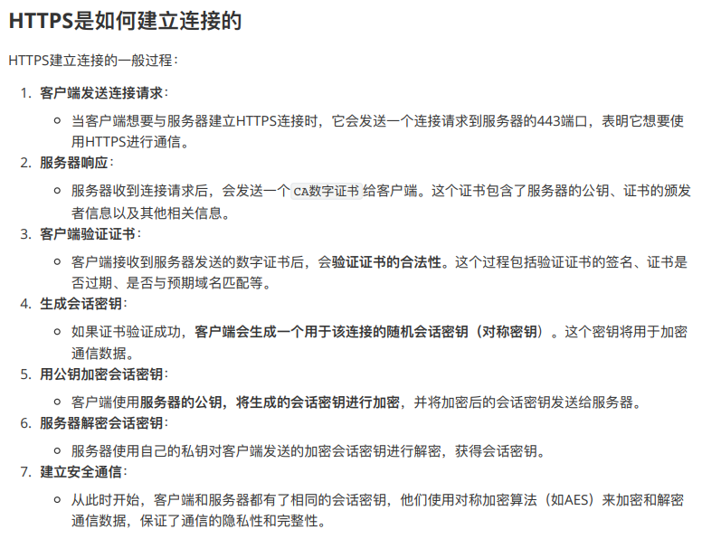

- [最基础的问题](#最基础的问题)
- [线程池相关](#线程池相关)
- [并发模型相关](#并发模型相关)
- [HTTP报文解析相关](#http报文解析相关)
- [数据库登录注册相关](#数据库登录注册相关)
- [定时器相关](#定时器相关)
- [日志相关](#日志相关)
- [压测相关](#压测相关)
- [综合能力](#综合能力)


# 最基础的问题

1. 首先自我介绍下，接着说下你最近的（或感觉不错的）一个项目。<br>
   
   这个项目是我在学习计算机网络和Linux socket编程过程中独立开发的轻量级Web服务器，服务器的网络模型采用同步I/O模拟实现proactor模式，IO处理使用了非阻塞IO和IO多路复用技术，具备处理多个客户端的http请求和ftp请求，以及对外提供轻量级存储的能力。这个项目从12月份开始做，到2月份完成了项目的整体功能。<br>
   **针对这个问题的延伸问法：高性能网络模式有哪些？IO多路复用技术？**<br>
   项目中的工作分为两个部分，一部分是服务器网络框架、日志系统、存储引擎等的一些基本系统的搭建，另一部分是为了提高服务器性能所做的一些优化，比如线程池等一些额外系统的搭建。<br>
   通过这个项目，我学习了两种Linux下的高性能网络模式，熟悉了Linux环境下的编程，把以前学习的基础知识串联了起来，同时了解了要实现一个项目的步骤：<br>
   1. 首先要根据特点把这个项目分解为许多模块，每个模块实现不同的功能
   2. 举个例子：例如半同步这里？
   
2. 请介绍一下你这个项目的业务流程？包含的主要模块以及自己负责的工作。
   
3. 你在做这个项目中，遇到的最大的难点、或者解决过的最复杂的 Bug 是什么？<br>
   
   1. 如何提高服务器的并发能力
   2. 由于涉及到I/O操作，当单条日志比较大的时候，同步模式会阻塞整个处理流程
   3. 多线程并发的情况下，保证线程的同步

4. 你的项目有实际上线么？使用哪种方式进行部署？
5. 哪里是自己觉得做的成功的，哪里觉得没做好的，是否还有继续优化的空间。自己所做的项目对个人能力有哪些提升。


*************************************************************************** 

# 线程池相关

1. 手写线程池
   ```cpp
   #include <iostream>
   #include <vector>
   #include <queue>
   #include <thread>
   #include <mutex>
   #include <functional>
   #include <condition_variable>

   class ThreadPool {
   public:
      // Constructor: Initializes the thread pool with a specified number of threads
      ThreadPool(size_t numThreads) : stop(false) {
         // Create specified number of worker threads
         for (size_t i = 0; i < numThreads; ++i) {
               // Each worker thread executes a lambda function
               workers.emplace_back([this] {
                  // Worker thread loop
                  while (true) {
                     std::function<void()> task; // Declare a task as a function
                     {
                           std::unique_lock<std::mutex> lock(queueMutex); // Lock the mutex
                           // Wait until there is a task in the queue or the thread pool is being stopped
                           condition.wait(lock, [this] { return stop || !tasks.empty(); });
                           // If the thread pool is being stopped and there are no tasks, exit the thread
                           if (stop && tasks.empty())
                              return;
                           // Get the task from the queue
                           task = std::move(tasks.front());
                           tasks.pop(); // Remove the task from the queue
                     }
                     // Execute the task
                     task();
                  }
               });
         }
      }

      // Method to enqueue a task
      template<class F, class... Args>
      void enqueue(F&& f, Args&&... args) {
         {
               std::unique_lock<std::mutex> lock(queueMutex); // Lock the mutex
               // Add the task to the queue, binding the arguments to the function
               tasks.emplace(std::bind(std::forward<F>(f), std::forward<Args>(args)...));
         }
         condition.notify_one(); // Notify one thread waiting for tasks
      }

      // Destructor: Stops the thread pool and joins all worker threads
      ~ThreadPool() {
         {
               std::unique_lock<std::mutex> lock(queueMutex); // Lock the mutex
               stop = true; // Set the stop flag to true
         }
         condition.notify_all(); // Notify all threads waiting for tasks
         // Join all worker threads
         for (std::thread& worker : workers)
               worker.join();
      }

   private:
      std::vector<std::thread> workers; // Vector to store worker threads
      std::queue<std::function<void()>> tasks; // Queue to store tasks

      std::mutex queueMutex; // Mutex to synchronize access to the task queue
      std::condition_variable condition; // Condition variable to notify threads about task availability
      bool stop; // Flag to signal the thread pool to stop execution
   };

   // Example function to be executed by the thread pool
   void printNumber(int num) {
      std::cout << "Number: " << num << std::endl;
   }

   int main() {
      ThreadPool pool(4); // Create a thread pool with 4 threads

      // Enqueue tasks
      for (int i = 0; i < 10; ++i) {
         pool.enqueue(printNumber, i); // Enqueue the task "printNumber" with argument "i"
      }

      // Sleep a bit to let the threads finish
      std::this_thread::sleep_for(std::chrono::seconds(2));

      return 0;
   }
   ```

2. 线程的同步机制有哪些？<br><br>
   <br>

3. 线程池中的工作线程是一直等待吗？

   线程池中的工作线程并不总是主动等待。 相反，它们以阻塞状态等待，直到队列中有可用任务或直到线程池停止。<br>

   等待机制的工作原理如下：<br>
   1. 每个工作线程进入一个循环，等待任务变得可用。
   2. 它锁定与任务队列关联的互斥锁以安全地访问它。
   3. 然后等待条件变量“condition”，每当新任务入队或线程池被销毁时都会通知该变量。
   4. 当条件变量被通知时（要么有新任务入队，要么正在销毁线程池），工作线程被唤醒。
   5. 如果队列中有任务，则将其出列并执行。
   6. 如果线程池正在停止并且队列中没有剩余任务，则工作线程退出循环并终止。

   因此，工作线程不会持续忙碌； 相反，它们大部分时间都处于等待状态，等待新任务的到来。 这种设计确保线程在等待任务时不会不必要地消耗CPU资源。 只有当有工作要做时，他们才会变得活跃。<br>

4. 你的线程池工作线程处理完一个任务后的状态是什么？

   这里需要分两种情况考虑：<br>

   1. 当处理完任务后如果请求队列为空，则这个线程重新回到阻塞等待的状态
   2. 当处理完任务后如果请求队列不为空，那么这个线程将处于与其他线程竞争资源的状态，谁获得锁谁就获得处理事件的资格

5. 如果同时1000个客户端进行访问请求，线程数不多，怎么能及时响应处理每一个呢？

   这种问法相当于问**服务器如何处理高并发的问题**。<br>

   首先我的项目中使用了I/O多路复用技术，每个线程中管理一定数量的连接，只有线程池中的连接有请求，epoll就会返回请求的连接列表，管理该连接的线程获取活动列表，然后依次处理各个连接的请求。如果该线程没有任务，就会等待分配任务。这样就可以达到服务器高并发的要求，同一时刻，每个线程都在处理自己所管理连接的请求。<br>

6. 如果一个客户请求需要占用线程很久的时间，会不会影响接下来的客户请求呢，有什么好的策略呢?

   会影响这个?请求的所在线程的所有请求，因为每个eventLoop都是依次处理它通过epoll获得的活动事件，也就是
   活动连接。如果该eventloop处理的连接占?时间过?的话，该线程后续的请求只能在请求队列中等待被处理，从
   ?影响接下来的客户请求。<br>

   应对策略：<br>

   1. **主 reactor 的角度**：可以记录?下每个从reactor的阻塞连接数，主reactor根据每个reactor的当前负载来分
   发请求，达到负载均衡的效果
   2. **从 reactor 的角度**
      1. 超时时间：为每个连接分配?个时间?，类似于操作系统的进程调度，当当前连接的时间??完以后，
         将其重新加?请求队列，响应其他连接的请求，进?步来说，还可以为每个连接设置?个优先级，这样
         可以优先响应重要的连接，有点像 HTTP/2 的优先级
      2. 关闭时间：为了避免部分连接?时间占?服务器资源，可以给每个连接设置?个最?响应时间，当?个
         连接的最?响应时间?完后，服务器可以主动将这个连接断开，让其重新连接

*************************************************************************** 


# 并发模型相关

1. 简单说一下服务器使用的并发模型？
   
   服务器涉及的并发模式指**I/O处理单元与逻辑单元**的协同完成任务的方法，称为**半同步/半反应堆并发模式**，是**半同步/半异步的变体**。<br>

   半同步/半异步模式工作流程：

   ```
   同步线程用于处理客户逻辑

   异步线程用于处理I/O事件

   异步线程监听到客户请求后，就将其封装成请求对象并插入请求队列中

   请求队列将通知某个工作在同步模式的工作线程来读取并处理该请求对象
   ```

   半同步/半反应堆工作流程（以Proactor模式为例）:

   ```
   主线程充当异步线程，负责监听所有socket上的事件

   若有新请求到来，主线程接收之以得到新的连接socket，然后往epoll内核事件表中注册该socket上的读写事件

   如果连接socket上有读写事件发生，主线程从socket上接收数据，并将数据封装成请求对象插入到请求队列中

   所有工作线程睡眠在请求队列上，当有任务到来时，通过竞争（如互斥锁）获得任务的接管权
   ````

2. reactor、proactor、主从reactor模型的区别？<br>
   
   reactor模式概念解释：<br>
   I/O 多路复用接口是面向过程的方式写代码的，这样的开发的效率不高。于是，研究者基于面向对象的思想，对 I/O 多路复用作了一层封装，让使用者不用考虑底层网络 API 的细节，只需要关注应用代码的编写，并把它称为Reactor 模式。<br>
   翻译过来的意思是「**反应堆**」，这里的反应指的是「**对事件反应**」，也就是来了一个事件，Reactor 就有相对应的反应/响应。Reactor 模式也叫 Dispatcher 模式，即 **I/O 多路复用监听事件**，收到事件后，根据事件类型分配（Dispatch）给某个进程 / 线程。<br>

   reactor模式的组成：<br>
   Reactor 模式主要由 Reactor 和处理资源池这两个核心部分组成，它俩负责的事情如下：
   1. Reactor 负责**监听和分发事件**，事件类型包含**连接事件、读写事件**
   2. 处理资源池负责**处理事件**，如 **read -> 业务逻辑 -> send**

   Reactor 模式经典实现方案：<br>
   1. 单 Reactor 单进程 / 线程
   2. 单 Reactor 多线程 / 进程
   3. 多 Reactor 多进程 / 线程

   接下来分别介绍这三个方案：<br>

   单 Reactor 单进程 / 线程<br><br>
   <br>
   
   1. Reactor 对象的作用是监听和分发事件；
   2. Acceptor 对象的作用是获取连接；
   3. Handler 对象的作用是处理业务

   运行过程：<br>

   1. Reactor 对象通过 IO 多路复用接口 监听事件，收到事件后通过 dispatch 进行分发，具体分发给 Acceptor 对象还是 Handler 对象，还要看收到的事件类型；
   2. 如果是连接建立的事件，则交由 Acceptor 对象进行处理，Acceptor 对象会通过 accept 方法 获取连接，并创建一个Handler 对象来处理后续的响应事件；
   3. 如果不是连接建立事件， 则交由当前连接对应的 Handler 对象来进行响应；
   4. Handler 对象通过 read -> 业务处理 -> send 的流程来完成完整的业务流程。
   
   优缺点：<br>

   优点：<br>
   单 Reactor 单进程的方案因为全部工作都在同一个进程内完成，所以实现起来比较简单，不需要考虑进程间通信，也不用担心多进程竞争。

   缺点： 
   1. 因为只有一个进程，无法充分利用 多核 CPU 的性能；
   2. Handler 对象在业务处理时，整个进程是无法处理其他连接的事件的，如果业务处理耗时比较长，那么就造成响应的延迟；

   **不适用计算机密集型的场景，只适用于业务处理非常快速的场景。**<br>

   单 Reactor 多线程 / 多进程：克服了「单 Reactor 单线程 / 进程」方案的缺点，引入多线程 / 多进程，也叫**主从reactor模型**<br><br>
   <br>

   前三个步骤和单 Reactor 单线程方案是一样的，接下来的步骤就开始不一样：<br>

   1. Handler 对象不再负责业务处理，**只负责数据的接收和发送**，Handler 对象通过 read 读取到数据后，会将数据发给线程池里的子线程中的 Processor 对象进行业务处理；
   2. 子线程里的 Processor 对象就进行业务处理，处理完后，将结果发给主线程中的 Handler 对象，接着由 Handler 通过 send 方法将响应结果发送给 client；

   单 Reator 多线程的方案优势在于能够充分利用多核 CPU 的能，那既然引入多线程，那么自然就带来了多线程竞争资源的问题。<br>
   另外，「单 Reactor」的模式还有个问题，因为一个 Reactor 对象承担所有事件的监听和响应，而且只在主线程中运行，在面对瞬间高并发的场景时，容易成为性能的瓶颈的地方。<br>

   多 Reactor 多进程 / 线程：要解决「单 Reactor」的问题，就是将「单 Reactor」实现成「多 Reactor」<br><br>
   <br>

   运行过程：<br>

   1. 主线程中的 MainReactor 对象通过 select 监控连接建立事件，收到事件后通过 Acceptor 对象中的 accept 获取连接，将新的连接分配给某个子线程；
   2. 子线程中的 SubReactor 对象将 MainReactor 对象分配的连接加入 select 继续进行监听，并创建一个 Handler 用于处理连接的响应事件。
   3. 如果有新的事件发生时，SubReactor 对象会调用当前连接对应的 Handler 对象来进行响应。
   4. Handler 对象通过 read -> 业务处理 -> send 的流程来完成完整的业务流程。
   
   优点：<br>

   1. 主线程和子线程分工明确，主线程只负责接收新连接，子线程负责完成后续的业务处理。
   2. 主线程和子线程的交互很简单，主线程只需要把新连接传给子线程，子线程无须返回数据，直接就可以在子线程将处理结果发送给客户端。

   **感觉这一整个发展过程就是一个不断解耦的过程，使得各个模块之间的耦合度降低。**<br>

   1. 单单：只有一个线程处理所有事情：Reactor、Acceptor、Handler
   2. 单多：分为主线程和线程池里面的子线程，其中主线程还是包含了Reactor、Acceptor、Handler，子线程中包含了Processor，用于业务处理。
   3. 多多：主线程中有MainReactor和Acceptor，子线程中有SubReactor和Handler

   接下来讲讲Proactor<br>

   前面提到的 Reactor 是非阻塞同步网络模式，而 Proactor 是异步网络模式。首先了解下什么是同步、异步、阻塞、非阻塞，参见[半同步半反应堆线程池](%E5%8D%8A%E5%90%8C%E6%AD%A5%E5%8D%8A%E5%8F%8D%E5%BA%94%E5%A0%86%E7%BA%BF%E7%A8%8B%E6%B1%A0.md)<br>

   **阻塞 I/O**，当用户程序执行 read ，线程会被阻塞，一直等到内核数据准备好，并把数据从内核缓冲区拷贝到应用程序的缓冲区中，当拷贝过程完成，read 才会返回。注意，阻塞等待的是「**内核数据准备好**」和「**数据从内核态拷贝到用户态**」这两个过程。过程如下图：<br><br><br>

   **非阻塞 I/O**，非阻塞的 read 请求在数据未准备好的情况下立即返回，可以继续往下执行，此时应用程序不断轮询内核，直到数据准备好，内核将数据拷贝到应用程序缓冲区，read 调用才可以获取到结果。过程如下图：<br><br><br>

   这里最后一次 read 调用，获取数据的过程，是一个**同步**的过程，是需要等待的过程。**这里的同步指的是内核态的数据拷贝到用户程序的缓存区这个过程**。所以**reactor就是这个模型**！<br>

   **结论：**<br>

   无论 read 和 send 是阻塞 I/O，还是非阻塞 I/O **都是同步调用**。因为在 read 调用时，**内核将数据从内核空间拷贝到用户空间的过程都是需要等待的**，也就是说这个过程是同步的，如果内核实现的拷贝效率不高，read 调用就会在这个同步过程中等待比较长的时间。<br>

   **真正的异步 I/O**： 是「**内核数据准备好**」和「**数据从内核态拷贝到用户态**」这两个过程**都不用等待**。<br><br><br>

   所以两个模式的区别如下：<br>

   1.  Reactor 是**非阻塞同步**网络模式，感知的是**就绪可读写事件**。可以理解为「**来了事件操作系统通知应用进程，让应用进程来处理**」， 基于「**待完成**」的 I/O 事件
   2.  Proactor 是**异步**网络模式， 感知的是**已完成的读写事件**。可以理解为「**来了事件操作系统来处理，处理完再通知应用进程**」，基于「**已完成**」的 I/O 事件。<br>

   所以两个模式主线程和工作线程任务差异如下：<br>

   1. reactor模式中，**主线程(I/O处理单元)**只负责监听文件描述符上是否有事件发生，有的话立即通知**工作线程(逻辑单元 )**，读写数据、接受新连接及**处理客户请求**均在工作线程中完成
   2. proactor模式中，**主线程和内核**负责处理读写数据、接受新连接等I/O操作，**工作线程**仅负责业务逻辑，如**处理客户请求**

   由于异步I/O并不成熟，实际中使用较少，这里将使用**同步I/O模拟的Proactor事件处理模式** 。<br>

3. 为什么会出现I/O多路复用技术？<br>
   
   **一对一通信 -> 多进程模型 -> 多线程模型 -> 线程池 -> I/O多路复用** <br>

   要想客户端和服务器能在网络中通信，那必须得使用 Socket 编程。 TCP Socket 调用流程是最简单、最基本的，它基本只能**一对一通信**，因为使用的是同步阻塞的方式，当服务端在还没处理完一个客户端的网络 I/O 时，或者 读写操作发生阻塞时，其他客户端是无法与服务端连接的。<br>
   可如果我们服务器只能服务一个客户，那这样就太浪费资源了。<br>

   基于最原始的阻塞网络 I/O， 如果服务器要支持多个客户端，其中比较传统的方式，就是使用**多进程模型**，也就是为每个客户端分配一个进程来处理请求。<br>
   具体来说，服务器的主进程负责监听客户的连接，一旦与客户端连接完成，accept() 函数就会返回一个「已连接 Socket」，这时就通过 fork() 函数创建一个子进程，即为每一个连接创建一个子进程。但是这种情况在**高并发的情况下是有问题的**，因为每产生一个进程，必会占据一定的系统资源，而且进程间上下文切换的“包袱”是很重的，性能会大打折扣。<br>

   既然进程间上下文切换的“包袱”很重，那我们就搞个比较轻量级的模型来应对多用户的请求 ―― **多线程模型**。如果每来一个连接就创建一个线程，线程运行完后，还得操作系统还得销毁线程，虽说线程切换的上写文开销不大，但是如果频繁创建和销毁线程，系统开销也是不小的。<br>

   我们可以使用**线程池**的方式来避免线程的频繁创建和销毁。所谓的线程池，其实就是空间换时间。即提前创建若干个线程，这样当由新连接建立时，将这个已连接的 Socket 放入到一个队列里，然后线程池里的线程负责从队列中取出「已连接 Socket 」进行处理。将连接分配给线程，然后一个线程可以处理多个连接的业务。不过，这样又引来一个新的问题，**线程怎样才能高效地处理多个连接的业务？**<br>
   当一个连接对应一个线程时，线程一般采用「**read -> 业务处理 -> send」**的处理流程，如果当前连接没有数据可读，那么线程会阻塞在 read 操作上（ socket 默认情况是阻塞 I/O）。<br>
   但是引入了线程池，线程在处理某个连接的 read 操作时，如果遇到没有数据可读，就会发生阻塞，**那么线程就没办法继续处理其他连接的业务**。<br>
   要解决这一个问题，最简单的方式**就是将 socket 改成非阻塞**，然后线程不断地**轮询**调用 read 操作来判断是否有数据，这种方式虽然该能够解决阻塞的问题，但是解决的方式比较粗暴，因为轮询是要消耗 CPU 的，而且随着一个 线程处理的连接越多，轮询的效率就会越低。<br>

   上面的问题在于，线程并不知道当前连接是否有数据可读，从而需要每次通过 read 去试探。<br>
   所以就出现了**I/O多路复用技术**：该技术会用一个系统调用函数来监听我们所有关心的连接，只有当连接上有数据的时候，线程才去发起读请求。<br>

4. 你用了epoll，说一下为什么用epoll，还有其他复用方式吗？区别是什么？<br>
   
   有select/poll/epoll，它们在获取事件时，先把所有连接（文件描述符）传给内核，再由内核返回产生了事件的连接，然后在用户态中再处理这些连接对应的请求即可。<br>

   select和poll十分相似：<br>

   **相同之处**：<br>
   将已连接的 Socket 都放到一个**文件描述符集合**，然后调用 select/poll 函数将文件描述符集合**拷贝**到内核里，让内核来检查是否有网络事件产生，检查的方式很粗暴，就是通过**遍历**文件描述符集合的方式，当检查到有事件产生后，将此 Socket 标记为可读或可写， 接着再把整个文件描述符集合**拷贝**回用户态里，然后用户态还需要再通过**遍历**的方法找到可读或可写的 Socket，然后再对其处理。<br>
   所以，对于 select/poll 这种方式，需要进行 2 次 **遍历** 文件描述符集合，一次是在**内核态**里，一个次是在**用户态**里 ，而且还会发生 2 次 **拷贝** 文件描述符集合，先从用户空间传入内核空间，由内核修改后，再传出到用户空间中。<br>

   **不同之处**：<br>
   poll 不再用 BitsMap 来存储所关注的文件描述符，取而代之用动态数组，以链表形式来组织，突破了 select 的1024个文件描述符个数限制，当然还会受到系统文件描述符限制。<br>

   接下来说下epoll，首先先看看epoll的用法：<br>
   ```
   int s = socket(AF_INET, SOCK_STREAM, 0);
   bind(s, ...);
   listen(s, ...)

   int epfd = epoll_create(...);
   epoll_ctl(epfd, ...); //将所有需要监听的socket添加到epfd中

   while(1) {
       int n = epoll_wait(...);
       for(接收到数据的socket){
           //处理
       }
   }
   ```
   如代码所示：先用 epoll_create 创建一个 epoll 对象 epfd，再通过 epoll_ctl 将需要监视的 socket 添加到epfd中，最后调用 epoll_wait 等待数据。<br>

   epoll通过两个方面解决了select/poll的问题：<br><br>
   <br>
   1. epoll 在内核里使用**红黑树来跟踪进程所有待检测的文件描述字**，把需要监控的 socket 通过 epoll_ctl() 函数加入内核中的红黑树里，红黑树是个高效的数据结构，增删改一般时间复杂度是 **O(logn)**。而 select/poll 内核里没有类似 epoll 红黑树这种保存所有待检测的 socket 的数据结构，所以 select/poll 每次操作时**都传入整个 socket 集合给内核**，而 epoll 因为在内核维护了红黑树，可以保存所有待检测的 socket ，所以**只需要传入一个待检测的 socket**，减少了内核和用户空间大量的数据拷贝和内存分配。
   2. epoll 使用**事件驱动**的机制，内核里**维护了一个链表来记录就绪事件**，当某个 socket 有事件发生时，通过回调函数内核会将其加入到这个就绪事件列表中，当用户调用 epoll_wait() 函数时，只会返回**有事件发生的文件描述符的个数**，不需要像 select/poll 那样轮询扫描整个 socket 集合，大大提高了检测的效率。

5. 了解事件触发方式吗？
   分别有边缘触发（edge-triggered，ET）和水平触发（level-triggered，LT）<br>

   概念上：<br>
   1. 使用边缘触发模式时，当被监控的 Socket 描述符上有可读事件发生时，服务器端**只会从 epoll_wait 中苏醒一次**，即使进程没有调用 read 函数从内核读取数据，也依然只苏醒一次，因此我们程序要保证一次性将内核缓冲区的数据读取完
   2. 使用水平触发模式时，当被监控的 Socket 上有可读事件发生时，服务器端**不断地从 epoll_wait 中苏醒**，直到内核缓冲区数据被 read 函数**读完才结束**，目的是告诉我们有数据需要读取
   
   水平触发的意思是**只要满足事件的条件，比如内核中有数据需要读**，就一直不断地把这个事件传递给用户；而边缘触发的意思是**只有第一次满足条件的时候才触发**，之后就不会再传递同样的事件了。<br>

   读写数据方面的区别：<br>
   1. 如果使用**水平触发模式**，当内核通知文件描述符可读写时，接下来还可以继续去检测它的状态，看它是否依然可读或可写。所以在收到通知后，**没必要一次执行尽可能多的读写操作**。<br>
   2. 使用边缘触发模式，I/O 事件发生时只会通知一次，而且我们不知道到底能读写多少数据，所以在收到通知后应尽可能地读写数据，因此，我们会**循环从文件描述符读写数据**。那么如果文件描述符是阻塞的，没有数据可读写时，进程会阻塞在读写函数那里，程序就没办法继续往下执行。所以，**边缘触发模式一般和非阻塞 I/O 搭配使用，程序会一直执行 I/O 操作，直到系统调用（如 read 和 write）返回错误，错误类型为 EAGAIN 或 EWOULDBLOCK**。

   效率方面的差异：<br>
   边缘触发的效率比水平触发的效率要高，因为边缘触发可以减少 epoll_wait 的系统调用次数，系统调用也是有一定的开销的的，毕竟也存在上下文的切换。<br>

   应用上的差异：<br>
   1. epoll 支持边缘触发和水平触发的方式
   2. 而 select/poll **只支持水平触发**


# HTTP报文解析相关

1. 用了状态机啊，为什么要用状态机？
   
   在此项目中，使用状态机对请求报文进行解析。状态机其实可以理解为if-else语句，通过判断输入状态进行对应的跳转。它的作用如下：

   1. **错误处理**：状态机可以根据输入在不同状态之间转换，这样解析器可以更好地检测语法错误或意外输入并做出相应响应。
   2. **可拓展性**：状态机非常灵活，可以适应 HTTP 协议的不同变体。

2. 状态机的转移图画一下

   <br><br>

   主状态机：三种状态，标识解析位置。

   1. CHECK_STATE_REQUESTLINE，解析请求行
   2. CHECK_STATE_HEADER，解析请求头
   3. CHECK_STATE_CONTENT，解析消息体，仅用于解析POST请求

   从状态机：三种状态，标识解析一行的读取状态。

   1. LINE_OK，完整读取一行
   2. LINE_BAD，报文语法有误
   3. LINE_OPEN，读取的行不完整

   在HTTP报文中，每一行的数据由\r\n作为结束字符，空行则是仅仅是字符\r\n。因此，可以通过查找\r\n将报文拆解成单独的行进行解析，项目中便是利用了这一点。<br>

3. https协议为什么安全？
   
   网线、光纤就好像铁轨，你发出去的数据包封装在tcp/udp/ip报文里，每个报文就相当于一节车厢。每节车厢装载着不同的货物、前往不同的目的地（ip）。当它们到了路由器/交换机等设备时，就会重新编组、从而沿着正确的线路前往自己的目的地，以上，是承载http/https的tcp/udp协议做的事。这个协议是不加密的，因此你的目标ip的确是可以知道的。<br>
   但tcp/udp的载荷，也就是每节车厢里面的货，它们是可以加密的。其中，http是不加密的，因此可以通过wireshark、tcpdump之类工具直接看到内容；而https是加密的――你可以知道它访问了哪台主机，但不可能知道它究竟传输了什么。<br>

4. https的ssl连接过程<br><br>

   <br><br><br>

5. GET和POST的区别

   首先这两个都是http的请求报文，都由请求行（request line）、请求头部（header）、空行和请求数据组成。但是Get请求没有消息体，所以在解析完空行后，就完成了对Get报文的解析。<br>


# 数据库登录注册相关

1. 登录说一下？

   <br><br>

   1. 服务器端解析浏览器的请求报文，解析请求报文，进而提取出用户名和密码
   2. 结合图和代码讲解下注册登录和页面跳转，主要是结合图，要大致画出来

2. 你这个保存状态了吗？如果要保存，你会怎么做？（cookie和session）

   以利用session或者cookie的方式进行状态的保存。

   1. cookie其实就是服务器给客户分配了一串“身份标识”，比如“123456789happy”这么一串字符串。每次客户发送数据时，都在HTTP报文附带上这个字符串，服务器就知道你是谁了；
   2. session是保存在服务器端的状态，每当一个客户发送HTTP报文过来的时候，服务器会在自己记录的用户数据中去找，类似于核对名单；

3. 登录中的用户名和密码你是load到本地，然后使用map匹配的，如果有10亿数据，即使load到本地后hash，也是很耗时的，你要怎么优化？

   这个问题的关键在于大数据量情况下的用户登录验证怎么进行？将所有的用户信息加载到内存中耗时耗利，对于大数据最遍历的方法就是 **进行hash**，**利用hash建立多级索引** 的方式来加快用户验证。具体操作如下：

   1. 首先，将10亿的用户信息，利用大致缩小1000倍的hash算法进行hash，这时就获得了100万的hash数据，每一个hash数据代表着一个用户信息块（一级）
   2. 而后，再分别对这100万的hash数据再进行hash，例如最终剩下1000个hash数据（二级）
   3. 在这种方式下，服务器只需要保存1000个二级hash数据，当用户请求登录的时候，先对用户信息进行一次hash，找到对应信息块（二级），在读取其对应的一级信息块，最终找到对应的用户数据，

4. 用的mysql啊，redis了解吗？用过吗？


# 定时器相关

1. 为什么要用定时器？

   处理定时任务，或者非活跃连接，节省系统资源。<br>
   其中非活跃是指客户端（这里是浏览器）与服务器端建立连接后，长时间不交换数据，一直占用服务器端的文件描述符，导致连接资源的浪费。<br>
   定时任务是指固定一段时间之后触发某段代码，由该段代码处理一个事件，如从内核事件表删除事件，并关闭文件描述符，释放连接资源。<br>

2. 说一下定时器的工作原理

   服务器就为各事件分配一个定时器。该项目使用SIGALRM信号来实现定时器，首先每一个定时事件都处于一个升序链表上，并按照超时时间升序排列。通过alarm()函数周期性触发SIGALRM信号，而后信号回调函数利用管道通知主循环，主循环接收到信号之后对升序链表上的定时器进行处理：若一定时间内无数据交换则关闭连接。

3. 双向链表啊，删除和添加的时间复杂度说一下？还可以优化吗？

   其中添加定时器的事件复杂度是O(n),删除定时器的事件复杂度是O(1)。<br>
   从双向链表的方式优化不太现实，可以考虑使用最小堆。<br>

4. 最小堆优化？说一下时间复杂度和工作原理

   最小堆以每个定时器的过期时间进行排序，最小的定时器位于堆顶，当SIGALRM信号触发tick（）函数时执行过期定时器清除，如果堆顶的定时器时间过期，则删除，并重新建堆，再判定是否过期，如此循环直到未过期为止。<br>
   插入，O(logn)；删除，O(logN)。<br>


# 日志相关

1. 说下你的日志系统的运行机制？

   初始化服务器时，利用单例模式初始化日志系统，根据配置文件确认是同步还是异步写入的方式。<br>
   看看单例模式如何实现 [日志系统](%E6%97%A5%E5%BF%97%E7%B3%BB%E7%BB%9F.md)<br>

2. 为什么要异步？和同步的区别是什么？

   同步方式写入日志时，日志写入函数与工作线程串行执行，由于涉及到I/O操作，当单条日志比较大的时候，同步模式会阻塞整个处理流程，服务器所能处理的并发能力将有所下降，尤其是在峰值的时候，写日志可能成为系统的瓶颈。<br>
   异步方式将所写的日志内容先存入阻塞队列，写线程从阻塞队列中取出内容，写入日志。采用生产者-消费者模型，具有较高的并发能力。<br>
   生产者和消费者是互斥关系，两者对缓冲区访问互斥，同时生产者和消费者又是一个相互协作与同步的关系，只有生产者生产之后，消费者才能消费。代码实现如下，其中，process_msg相当于消费者，enqueue_msg相当于生产者，struct msg* workq作为缓冲队列。<br>
   ```cpp
   #include <pthread.h>
   struct msg {
   struct msg *m_next;
   /* value...*/
   };
   
   struct msg* workq;
   pthread_cond_t qready = PTHREAD_COND_INITIALIZER;
   pthread_mutex_t qlock = PTHREAD_MUTEX_INITIALIZER;

   void
   process_msg() {
   struct msg* mp;
   for (;;) {
      pthread_mutex_lock(&qlock);
      //这里需要用while，而不是if
      while (workq == NULL) {
         pthread_cond_wait(&qread, &qlock);
      }
      mq = workq;
      workq = mp->m_next;
      pthread_mutex_unlock(&qlock);
      /* now process the message mp */
   }
   }

   void
   enqueue_msg(struct msg* mp) {
      pthread_mutex_lock(&qlock);
      mp->m_next = workq;
      workq = mp;
      pthread_mutex_unlock(&qlock);
      /** 此时另外一个线程在signal之前，执行了process_msg，刚好把mp元素拿走*/
      pthread_cond_signal(&qready);
      /** 此时执行signal, 在pthread_cond_wait等待的线程被唤醒，
         但是mp元素已经被另外一个线程拿走，所以，workq还是NULL ,因此需要继续等待*/
   }
   ```

1. 现在你要监控一台服务器的状态，输出监控日志，请问如何将该日志分发到不同的机器上？（消息队列）


# 压测相关

1. 服务器并发量测试过吗？怎么测试的？

2. webbench是什么？介绍一下原理

   webbench是一款轻量级的网址压力测试工具，可以实现高达3万的并发测试。<br>
   其原理：Webbench实现的核心原理是：父进程fork若干个子进程，每个子进程在用户要求时间或默认的时间内对目标web循环发出实际访问请求，父子进程通过管道进行通信，子进程通过管道写端向父进程传递在若干次请求访问完毕后记录到的总信息，父进程通过管道读端读取子进程发来的相关信息，子进程在时间到后结束，父进程在所有子进程退出后统计并给用户显示最后的测试结果，然后退出。<br>

3. 测试的时候有没有遇到问题？


# 综合能力

1. 你的项目解决了哪些其他同类项目没有解决的问题？

2. 说一下前端发送请求后，服务器处理的过程，中间涉及哪些协议？

   HTTP协议、TCP、IP协议等，计算机网络的知识。<br>