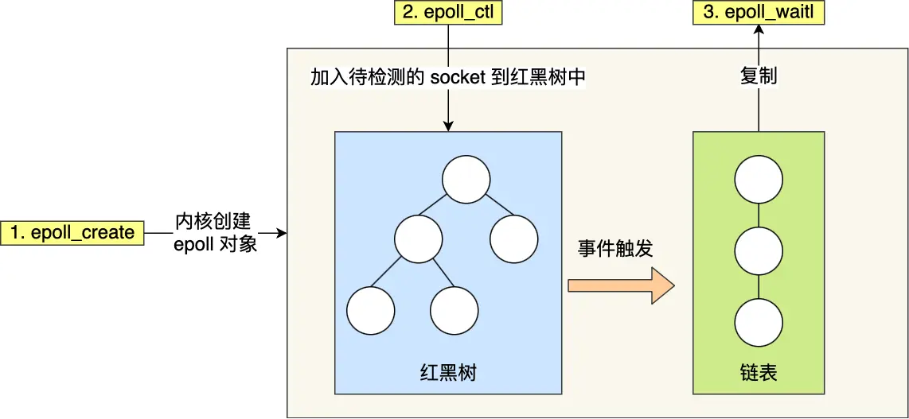

- [最基础的问题](#最基础的问题)
- [线程池相关](#线程池相关)
- [并发模型相关](#并发模型相关)
- [HTTP报文解析相关](#http报文解析相关)
- [数据库登录注册相关](#数据库登录注册相关)
- [定时器相关](#定时器相关)
- [日志相关](#日志相关)
- [压测相关](#压测相关)
- [综合能力](#综合能力)


# 最基础的问题

1. 首先自我介绍下，接着说下你最近的（或感觉不错的）一个项目。<br>
   
   这个项目是我在学习计算机网络和Linux socket编程过程中独立开发的轻量级Web服务器，服务器的网络模型采用同步I/O模拟实现proactor模式，IO处理使用了非阻塞IO和IO多路复用技术，具备处理多个客户端的http请求和ftp请求，以及对外提供轻量级存储的能力。这个项目从12月份开始做，到2月份完成了项目的整体功能。<br>
   **针对这个问题的延伸问法：高性能网络模式有哪些？IO多路复用技术？**<br>
   项目中的工作分为两个部分，一部分是服务器网络框架、日志系统、存储引擎等的一些基本系统的搭建，另一部分是为了提高服务器性能所做的一些优化，比如线程池等一些额外系统的搭建。<br>
   通过这个项目，我学习了两种Linux下的高性能网络模式，熟悉了Linux环境下的编程，把以前学习的基础知识串联了起来，同时了解了要实现一个项目的步骤：<br>
   1. 首先要根据特点把这个项目分解为许多模块，每个模块实现不同的功能
   2. 举个例子：例如半同步这里？
   
2. 请介绍一下你这个项目的业务流程？包含的主要模块以及自己负责的工作。
   
3. 你在做这个项目中，遇到的最大的难点、或者解决过的最复杂的 Bug 是什么？<br>
   
   可以参考代码随想录文件。<br>
   bug可以举例大文件传输？<br>

4. 你的项目有实际上线么？使用哪种方式进行部署？
5. 哪里是自己觉得做的成功的，哪里觉得没做好的，是否还有继续优化的空间。自己所做的项目对个人能力有哪些提升。


# 线程池相关

1. 手写线程池
2. 线程的同步机制有哪些？
3. 线程池中的工作线程是一直等待吗？
4. 你的线程池工作线程处理完一个任务后的状态是什么？
5. 如果同时1000个客户端进行访问请求，线程数不多，怎么能及时响应处理每一个呢？
6. 如果一个客户请求需要占用线程很久的时间，会不会影响接下来的客户请求呢，有什么好的策略呢?


# 并发模型相关

1. 简单说一下服务器使用的并发模型？
2. reactor、proactor、主从reactor模型的区别？<br>
   
   reactor模式概念解释：<br>
   I/O 多路复用接口是面向过程的方式写代码的，这样的开发的效率不高。于是，研究者基于面向对象的思想，对 I/O 多路复用作了一层封装，让使用者不用考虑底层网络 API 的细节，只需要关注应用代码的编写，并把它称为Reactor 模式。<br>
   翻译过来的意思是「**反应堆**」，这里的反应指的是「**对事件反应**」，也就是来了一个事件，Reactor 就有相对应的反应/响应。Reactor 模式也叫 Dispatcher 模式，即 **I/O 多路复用监听事件**，收到事件后，根据事件类型分配（Dispatch）给某个进程 / 线程。<br>

   reactor模式的组成：<br>
   Reactor 模式主要由 Reactor 和处理资源池这两个核心部分组成，它俩负责的事情如下：
   1. Reactor 负责**监听和分发事件**，事件类型包含**连接事件、读写事件**
   2. 处理资源池负责**处理事件**，如 **read -> 业务逻辑 -> send**

   Reactor 模式经典实现方案：<br>
   1. 单 Reactor 单进程 / 线程；
   2. 单 Reactor 多线程 / 进程；
   3. 多 Reactor 多进程 / 线程；

   接下来分别介绍这三个方案：<br>

   单 Reactor 单进程 / 线程<br><br>
   
   1. Reactor 对象的作用是监听和分发事件；
   2. Acceptor 对象的作用是获取连接；
   3. Handler 对象的作用是处理业务

   运行过程：<br>

   4. Reactor 对象通过 IO 多路复用接口 监听事件，收到事件后通过 dispatch 进行分发，具体分发给 Acceptor 对象还是 Handler 对象，还要看收到的事件类型；
   5. 如果是连接建立的事件，则交由 Acceptor 对象进行处理，Acceptor 对象会通过 accept 方法 获取连接，并创建一个 Handler 对象来处理后续的响应事件；
   6. 如果不是连接建立事件， 则交由当前连接对应的 Handler 对象来进行响应；
   7. Handler 对象通过 read -> 业务处理 -> send 的流程来完成完整的业务流程。
   
   优缺点：<br>

   优点：
   8. 单 Reactor 单进程的方案因为全部工作都在同一个进程内完成，所以实现起来比较简单，不需要考虑进程间通信，也不用担心多进程竞争。

   缺点： 
   9. 因为只有一个进程，无法充分利用 多核 CPU 的性能；
   10. Handler 对象在业务处理时，整个进程是无法处理其他连接的事件的，如果业务处理耗时比较长，那么就造成响应的延迟；

   **不适用计算机密集型的场景，只适用于业务处理非常快速的场景。**<br>

   单 Reactor 多线程 / 多进程：克服了「单 Reactor 单线程 / 进程」方案的缺点，引入多线程 / 多进程，也叫**主从reactor模型**<br><br>

   前三个步骤和单 Reactor 单线程方案是一样的，接下来的步骤就开始不一样：<br>

   1. Handler 对象不再负责业务处理，**只负责数据的接收和发送**，Handler 对象通过 read 读取到数据后，会将数据发给子线程里的 Processor 对象进行业务处理；
   2. 子线程里的 Processor 对象就进行业务处理，处理完后，将结果发给主线程中的 Handler 对象，接着由 Handler 通过 send 方法将响应结果发送给 client；

   单 Reator 多线程的方案优势在于能够充分利用多核 CPU 的能，那既然引入多线程，那么自然就带来了多线程竞争资源的问题。<br>
   另外，「单 Reactor」的模式还有个问题，因为一个 Reactor 对象承担所有事件的监听和响应，而且只在主线程中运行，在面对瞬间高并发的场景时，容易成为性能的瓶颈的地方。<br>

   多 Reactor 多进程 / 线程：要解决「单 Reactor」的问题，就是将「单 Reactor」实现成「多 Reactor」<br><br>

   运行过程：<br>

   1. 主线程中的 MainReactor 对象通过 select 监控连接建立事件，收到事件后通过 Acceptor 对象中的 accept 获取连接，将新的连接分配给某个子线程；
   2. 子线程中的 SubReactor 对象将 MainReactor 对象分配的连接加入 select 继续进行监听，并创建一个 Handler 用于处理连接的响应事件。
   3.  如果有新的事件发生时，SubReactor 对象会调用当前连接对应的 Handler 对象来进行响应。
   4.  Handler 对象通过 read -> 业务处理 -> send 的流程来完成完整的业务流程。
   
   优点：<br>

   1. 主线程和子线程分工明确，主线程只负责接收新连接，子线程负责完成后续的业务处理。
   2. 主线程和子线程的交互很简单，主线程只需要把新连接传给子线程，子线程无须返回数据，直接就可以在子线程将处理结果发送给客户端。

   **感觉这一整个发展过程就是一个不断解耦的过程，使得各个模块之间的耦合度降低。**<br>
   
3. 为什么会出现I/O多路复用技术？<br>
   
   **一对一通信 -> 多进程模型 -> 多线程模型 -> 线程池 -> I/O多路复用** <br>

   要想客户端和服务器能在网络中通信，那必须得使用 Socket 编程。 TCP Socket 调用流程是最简单、最基本的，它基本只能**一对一通信**，因为使用的是同步阻塞的方式，当服务端在还没处理完一个客户端的网络 I/O 时，或者 读写操作发生阻塞时，其他客户端是无法与服务端连接的。<br>
   可如果我们服务器只能服务一个客户，那这样就太浪费资源了。<br>

   基于最原始的阻塞网络 I/O， 如果服务器要支持多个客户端，其中比较传统的方式，就是使用**多进程模型**，也就是为每个客户端分配一个进程来处理请求。<br>
   具体来说，服务器的主进程负责监听客户的连接，一旦与客户端连接完成，accept() 函数就会返回一个「已连接 Socket」，这时就通过 fork() 函数创建一个子进程，即为每一个连接创建一个子进程。但是这种情况在**高并发的情况下是有问题的**，因为每产生一个进程，必会占据一定的系统资源，而且进程间上下文切换的“包袱”是很重的，性能会大打折扣。<br>

   既然进程间上下文切换的“包袱”很重，那我们就搞个比较轻量级的模型来应对多用户的请求 ―― **多线程模型**。如果每来一个连接就创建一个线程，线程运行完后，还得操作系统还得销毁线程，虽说线程切换的上写文开销不大，但是如果频繁创建和销毁线程，系统开销也是不小的。<br>

   我们可以使用**线程池**的方式来避免线程的频繁创建和销毁。所谓的线程池，其实就是空间换时间。即提前创建若干个线程，这样当由新连接建立时，将这个已连接的 Socket 放入到一个队列里，然后线程池里的线程负责从队列中取出「已连接 Socket 」进行处理。将连接分配给线程，然后一个线程可以处理多个连接的业务。不过，这样又引来一个新的问题，**线程怎样才能高效地处理多个连接的业务？**<br>
   当一个连接对应一个线程时，线程一般采用「**read -> 业务处理 -> send」**的处理流程，如果当前连接没有数据可读，那么线程会阻塞在 read 操作上（ socket 默认情况是阻塞 I/O）。<br>
   但是引入了线程池，线程在处理某个连接的 read 操作时，如果遇到没有数据可读，就会发生阻塞，**那么线程就没办法继续处理其他连接的业务**。<br>
   要解决这一个问题，最简单的方式**就是将 socket 改成非阻塞**，然后线程不断地**轮询**调用 read 操作来判断是否有数据，这种方式虽然该能够解决阻塞的问题，但是解决的方式比较粗暴，因为轮询是要消耗 CPU 的，而且随着一个 线程处理的连接越多，轮询的效率就会越低。<br>

   上面的问题在于，线程并不知道当前连接是否有数据可读，从而需要每次通过 read 去试探。<br>
   所以就出现了**I/O多路复用技术**：该技术会用一个系统调用函数来监听我们所有关心的连接，只有当连接上有数据的时候，线程才去发起读请求。<br>

4. 你用了epoll，说一下为什么用epoll，还有其他复用方式吗？区别是什么？<br>
   
   有select/poll/epoll，它们在获取事件时，先把所有连接（文件描述符）传给内核，再由内核返回产生了事件的连接，然后在用户态中再处理这些连接对应的请求即可。<br>

   select和poll十分相似：<br>
   **相同之处**：<br>
   将已连接的 Socket 都放到一个**文件描述符集合**，然后调用 select/poll 函数将文件描述符集合**拷贝**到内核里，让内核来检查是否有网络事件产生，检查的方式很粗暴，就是通过**遍历**文件描述符集合的方式，当检查到有事件产生后，将此 Socket 标记为可读或可写， 接着再把整个文件描述符集合**拷贝**回用户态里，然后用户态还需要再通过**遍历**的方法找到可读或可写的 Socket，然后再对其处理。<br>
   所以，对于 select/poll 这种方式，需要进行 2 次 **遍历** 文件描述符集合，一次是在**内核态**里，一个次是在**用户态**里 ，而且还会发生 2 次 **拷贝** 文件描述符集合，先从用户空间传入内核空间，由内核修改后，再传出到用户空间中。<br>
   **不同之处**：<br>
   poll 不再用 BitsMap 来存储所关注的文件描述符，取而代之用动态数组，以链表形式来组织，突破了 select 的1024个文件描述符个数限制，当然还会受到系统文件描述符限制。<br>

   接下来说下epoll，首先先看看epoll的用法：<br>
   ```
   int s = socket(AF_INET, SOCK_STREAM, 0);
   bind(s, ...);
   listen(s, ...)

   int epfd = epoll_create(...);
   epoll_ctl(epfd, ...); //将所有需要监听的socket添加到epfd中

   while(1) {
       int n = epoll_wait(...);
       for(接收到数据的socket){
           //处理
       }
   }
   ```
   如代码所示：先用 epoll_create 创建一个 epoll 对象 epfd，再通过 epoll_ctl 将需要监视的 socket 添加到epfd中，最后调用 epoll_wait 等待数据。<br>

   epoll通过两个方面解决了select/poll的问题：<br>
   <br>
   1. epoll 在内核里使用**红黑树来跟踪进程所有待检测的文件描述字**，把需要监控的 socket 通过 epoll_ctl() 函数加入内核中的红黑树里，红黑树是个高效的数据结构，增删改一般时间复杂度是 **O(logn)**。而 select/poll 内核里没有类似 epoll 红黑树这种保存所有待检测的 socket 的数据结构，所以 select/poll 每次操作时**都传入整个 socket 集合给内核**，而 epoll 因为在内核维护了红黑树，可以保存所有待检测的 socket ，所以**只需要传入一个待检测的 socket**，减少了内核和用户空间大量的数据拷贝和内存分配。
   2. epoll 使用**事件驱动**的机制，内核里**维护了一个链表来记录就绪事件**，当某个 socket 有事件发生时，通过回调函数内核会将其加入到这个就绪事件列表中，当用户调用 epoll_wait() 函数时，只会返回**有事件发生的文件描述符的个数**，不需要像 select/poll 那样轮询扫描整个 socket 集合，大大提高了检测的效率。

5. 了解事件触发方式吗？
   分别有边缘触发（edge-triggered，ET）和水平触发（level-triggered，LT）<br>

   概念上：<br>
   1. 使用边缘触发模式时，当被监控的 Socket 描述符上有可读事件发生时，服务器端**只会从 epoll_wait 中苏醒一次**，即使进程没有调用 read 函数从内核读取数据，也依然只苏醒一次，因此我们程序要保证一次性将内核缓冲区的数据读取完
   2. 使用水平触发模式时，当被监控的 Socket 上有可读事件发生时，服务器端**不断地从 epoll_wait 中苏醒**，直到内核缓冲区数据被 read 函数**读完才结束**，目的是告诉我们有数据需要读取
   
   水平触发的意思是**只要满足事件的条件，比如内核中有数据需要读**，就一直不断地把这个事件传递给用户；而边缘触发的意思是**只有第一次满足条件的时候才触发**，之后就不会再传递同样的事件了。<br>

   读写数据方面的区别：<br>
   3. 如果使用**水平触发模式**，当内核通知文件描述符可读写时，接下来还可以继续去检测它的状态，看它是否依然可读或可写。所以在收到通知后，**没必要一次执行尽可能多的读写操作**。
   4. 使用边缘触发模式，I/O 事件发生时只会通知一次，而且我们不知道到底能读写多少数据，所以在收到通知后应尽可能地读写数据，因此，我们会**循环从文件描述符读写数据**。那么如果文件描述符是阻塞的，没有数据可读写时，进程会阻塞在读写函数那里，程序就没办法继续往下执行。所以，**边缘触发模式一般和非阻塞 I/O 搭配使用，程序会一直执行 I/O 操作，直到系统调用（如 read 和 write）返回错误，错误类型为 EAGAIN 或 EWOULDBLOCK**。

   效率方面的差异：<br>
   边缘触发的效率比水平触发的效率要高，因为边缘触发可以减少 epoll_wait 的系统调用次数，系统调用也是有一定的开销的的，毕竟也存在上下文的切换。<br>

   应用上的差异：<br>
   5. epoll 支持边缘触发和水平触发的方式
   6. 而 select/poll **只支持水平触发**


# HTTP报文解析相关

1. 用了状态机啊，为什么要用状态机？
2. 状态机的转移图画一下
3. https协议为什么安全？
4. https的ssl连接过程
5. GET和POST的区别


# 数据库登录注册相关

1. 登录说一下？
2. 你这个保存状态了吗？如果要保存，你会怎么做？（cookie和session）
3. 登录中的用户名和密码你是load到本地，然后使用map匹配的，如果有10亿数据，即使load到本地后hash，也是很耗时的，你要怎么优化？
4. 用的mysql啊，redis了解吗？用过吗？


# 定时器相关

1. 为什么要用定时器？
2. 说一下定时器的工作原理
3. 双向链表啊，删除和添加的时间复杂度说一下？还可以优化吗？
4. 最小堆优化？说一下时间复杂度和工作原理


# 日志相关

1. 说下你的日志系统的运行机制？
2. 为什么要异步？和同步的区别是什么？
3. 现在你要监控一台服务器的状态，输出监控日志，请问如何将该日志分发到不同的机器上？（消息队列）


# 压测相关

1. 服务器并发量测试过吗？怎么测试的？
2. webbench是什么？介绍一下原理
3. 测试的时候有没有遇到问题？


# 综合能力

1. 你的项目解决了哪些其他同类项目没有解决的问题？
2. 说一下前端发送请求后，服务器处理的过程，中间涉及哪些协议？