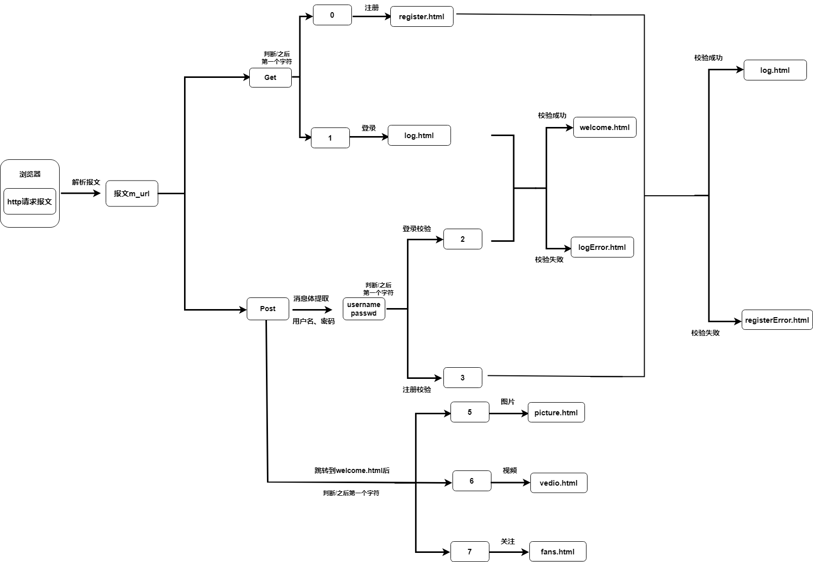
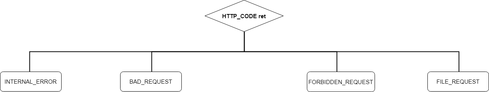

- [如何画流程图](#如何画流程图)
- [http报文处理流程](#http报文处理流程)
  - [报文接收](#报文接收)
  - [请求报文解析](#请求报文解析)
  - [请求报文响应](#请求报文响应)
- [定时器处理非活动连接](#定时器处理非活动连接)


# 如何画流程图

[不会画流程图？看这一篇就够了](https://zhuanlan.zhihu.com/p/673584294)<br>


# http报文处理流程

总体流程：<br>

1. 浏览器端发出http连接请求，主线程创建http对象接收请求并将所有数据读入对应buffer，将该对象插入任务队列，工作线程从任务队列中取出一个任务进行处理。
2. 工作线程取出任务后，调用process_read函数，通过主、从状态机对请求报文进行解析。
3. 解析完之后，跳转do_request函数生成响应报文，通过process_write写入buffer，返回给浏览器端。

图示：<br><br>


## 报文接收

<br>

```cpp
// read_once定义
//循环读取客户数据，直到无数据可读或对方关闭连接
bool http_conn::read_once()
{
    if(m_read_idx>=READ_BUFFER_SIZE)
    {
        return false;
    }
    int bytes_read=0;
    while(true)
    {
        //从套接字接收数据，存储在m_read_buf缓冲区
        bytes_read=recv(m_sockfd,m_read_buf+m_read_idx,READ_BUFFER_SIZE-m_read_idx,0);
        if(bytes_read==-1)
        {    
            //非阻塞ET模式下，需要一次性将数据读完
            if(errno==EAGAIN||errno==EWOULDBLOCK)
                break;
            return false;
        }
        else if(bytes_read==0)
        {
            return false;
        }
        //修改m_read_idx的读取字节
        m_read_idx+=bytes_read;
    }
    return true;
}
```


## 请求报文解析

主状态机状态：

1. CHECK_STATE_REQUESTLINE，解析请求行
2. CHECK_STATE_HEADER，解析请求头
3. CHECK_STATE_CONTENT，解析消息体，仅用于解析POST请求

从状态机状态：

1. LINE_OK，完整读取一行
2. LINE_BAD，报文语法有误
3. LINE_OPEN，读取的行不完整

从状态机负责读取报文的一行，主状态机负责对该行数据进行解析，主状态机内部调用从状态机，从状态机驱动主状态机。得出状态机图如下：<br><br>

请求报文返回的HTTP_CODE的含义：<br>

| HTTP_CODE | 含义 |
| -- | -- | 
| NO_REQUEST  | 1. 请求不完整，需要继续读取请求报文数据 2. 跳转主线程继续监测读事件 |
| GET_REQUEST | 1. 获得了完整的HTTP请求 2. 调用do_request完成请求资源映射 |
| NO_RESOURCE | 1. 请求资源不存在 2. 跳转process_write完成响应报文 |
| BAD_REQUEST | 1. HTTP请求报文有语法错误或请求资源为目录 2. 跳转process_write完成响应报文 |
| FORBIDDEN_REQUEST | 1. 请求资源禁止访问，没有读取权限 2. 跳转process_write完成响应报文 |
| FILE_REQUEST | 1. 请求资源可以正常访问 2. 跳转process_write完成响应报文 |
| INTERNAL_ERROR | 1. 服务器内部错误，该结果在主状态机逻辑switch的default下，一般不会触发 |

HTTP常见状态码：<br>

- 1xx：指示信息--表示请求已接收，继续处理。
- 2xx：成功--表示请求正常处理完毕。
    - 200 OK：客户端请求被正常处理。
    - 206 Partial content：客户端进行了范围请求。
- 3xx：重定向--要完成请求必须进行更进一步的操作。
    - 301 Moved Permanently：永久重定向，该资源已被永久移动到新位置，将来任何对该资源的访问都要使用本响应返回的若干个URI之一。
    - 302 Found：临时重定向，请求的资源现在临时从不同的URI中获得。
- 4xx：客户端错误--请求有语法错误，服务器无法处理请求。
    - 400 Bad Request：请求报文存在语法错误。
    - 403 Forbidden：请求被服务器拒绝。
    - 404 Not Found：请求不存在，服务器上找不到请求的资源。
- 5xx：服务器端错误--服务器处理请求出错。
    - 500 Internal Server Error：服务器在执行请求时出现错误。


## 请求报文响应

do_request生成响应报文流程图，感觉就是注册登录流程图：<br><br>

根据do_request和process_read返回的HTTP_CODE，process_write把响应报文写入buffer，返回给浏览器端：<br><br>


# 定时器处理非活动连接

信号处理流程：<br>
Linux下的信号采用的异步处理机制，信号处理函数和当前进程是两条不同的执行路线。具体的，当进程收到信号时，操作系统会中断进程当前的正常流程，转而进入信号处理函数执行操作，完成后再返回中断的地方继续执行。<br>
具体的，信号处理函数使用管道将信号传递给主循环，信号处理函数往管道的写端写入信号值，主循环则从管道的读端读出信号值，使用I/O复用系统调用来监听管道读端的可读事件，这样信号事件与其他文件描述符都可以通过epoll来监测，从而实现统一处理。<br>
并且把这种将信号事件与其他事件一样被处理称为统一事件源。<br>