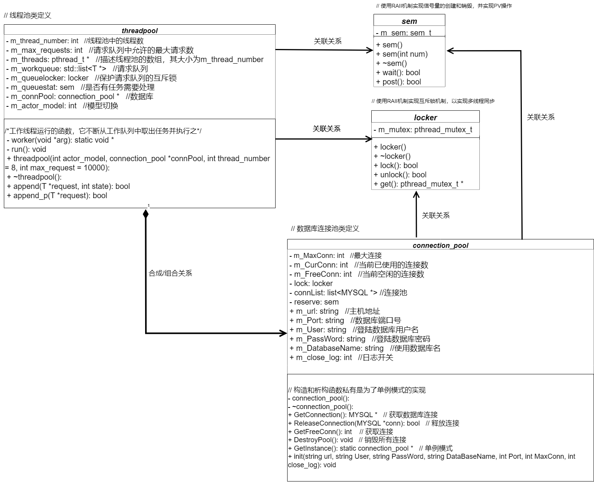
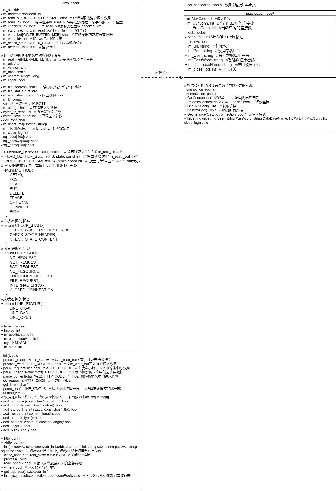
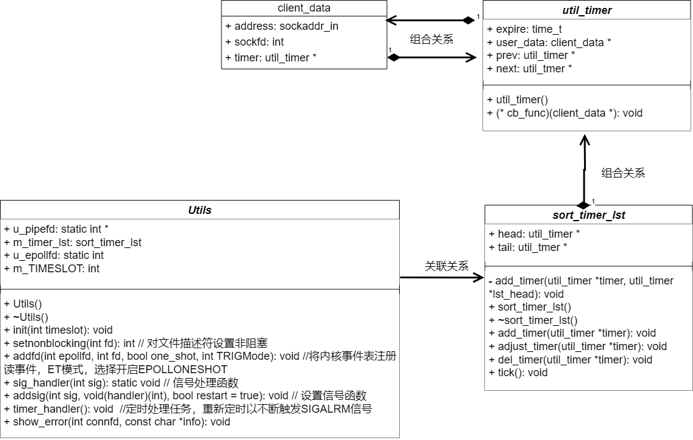
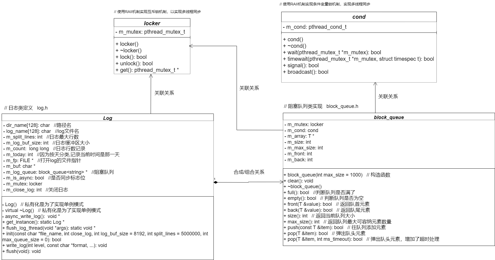
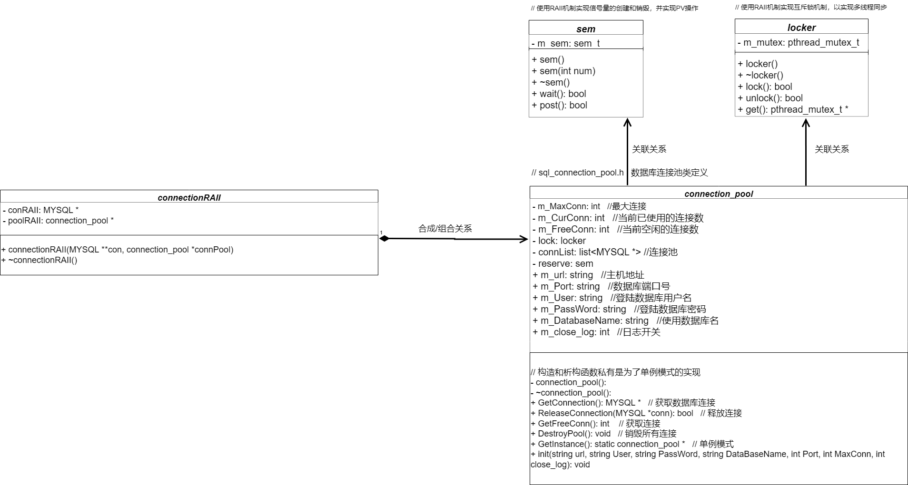

- [线程同步机制](#线程同步机制)
- [半同步半反应堆线程池](#半同步半反应堆线程池)
- [http连接处理](#http连接处理)
- [定时器处理非活动连接](#定时器处理非活动连接)
- [日志系统](#日志系统)
- [数据库模块](#数据库模块)

# 线程同步机制

 

# 半同步半反应堆线程池

 

# http连接处理

 

# 定时器处理非活动连接

项目中将连接资源、定时事件和超时时间封装为定时器类**util_timer**，其中client_data为连接资源，具体包括客户端套接字地址、文件描述符和定时器。 
定时器容器**sort_timer_lst**为带头尾结点的升序双向链表，具体的为每个连接创建一个定时器，将其添加到链表中，并按照超时时间升序排列。执行定时任务时，将到期的定时器从链表中删除。类中各函数具体逻辑如下：

1. add_timer函数，将目标定时器添加到链表中，添加时按照升序添加
   1. 若当前链表中只有头尾节点，直接插入
   2. 否则，将定时器按升序插入
2. adjust_timer函数，当定时任务发生变化,调整对应定时器在链表中的位置
   1. 客户端在设定时间内有数据收发,则当前时刻对该定时器重新设定时间，这里只是往后延长超时时间
   2. 被调整的目标定时器在尾部，或定时器新的超时值仍然小于下一个定时器的超时，不用调整
   3. 否则先将定时器从链表取出，重新插入链表
3. del_timer函数将超时的定时器从链表中删除
   1. 常规双向链表删除结点
4. 使用统一事件源，SIGALRM信号每次被触发，主循环中调用一次定时任务处理函数 tick()，处理链表容器中到期的定时器
   1. 遍历定时器升序链表容器，从头结点开始依次处理每个定时器，直到遇到尚未到期的定时器
   2. 若当前时间小于定时器超时时间，跳出循环，即未找到到期的定时器
   3. 若当前时间大于定时器超时时间，即找到了到期的定时器，执行回调函数，然后将它从链表中删除，然后继续遍历

 

# 日志系统

 

# 数据库模块

 