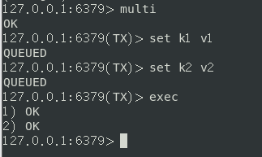
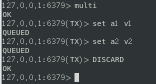
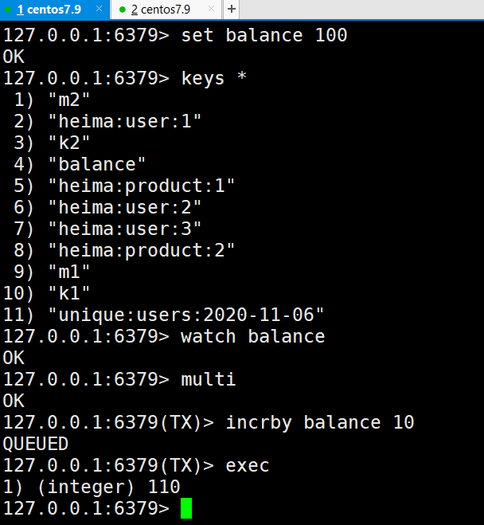
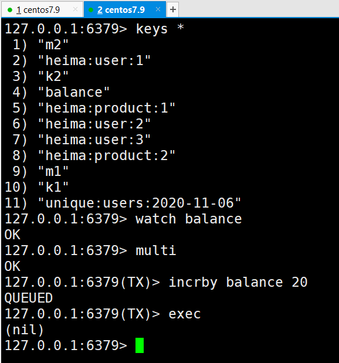

# redis的事务
redis事务是一个单独的隔离操作：事务中的所有命令都会序列化、按顺序执行。   
所以redis事务的主要作用是 **串联多个命令** 防止别的命令插队。

# Multi、Exec、discard
从输入Multi开始，输入的命令会排队进入到命令队列中，但是不会执行，直到输入Exec才会执行。在组队过程中，可以通过输入discard放弃组队。  
  
multi案例：  
  

discard案例：  
  

# 事务的错误处理
分两种情况：  
1. 组队过程中，一旦出现了错误的命令，那么整个队列都会被取消；
2. 执行过程中某个命令报错，则只有报错的命令不被执行，其他正常执行，不会回滚。  

第一种情况演示：      
  

第二种情况演示：  

# 事务冲突的问题
## 例子

## 悲观锁  
顾名思义，就是有点悲观情绪在里面的锁机制。该机制认为每次去拿数据的时候都会对数据进行修改，所以每次拿数据的时候都会上锁，如果此时有其他用户想访问该数据就会被阻塞。   
如图：   
   

MySQL里面的行锁、表锁、读锁、写锁都是这种锁，很明显，这种锁的缺点是效率很低。   

## 乐观锁  
每次取数据时都认为用户不会修改数据，所以不会上锁，但是在更新的时候会判断在此期间其他用户有没有修改数据，利用的是check-and-set机制：在操作前，给数据加上一个版本号，操作完后再修改版本号；当另一个用户要操作时，检查该用户当前数据版本号是否等于数据库中的数据的版本号，相等才可以操作。**抢票就是这样一个例子。**   
如图：   
   

## watch key && unwatch
在执行multi前，可以使用watch对一个或多个key进行监视，如果事务执行前key被其他命令改动，那么事务会被打断。   
类似地，unwatch的作用是在事务执行完后取消对key的监视。   
案例演示，**通过watch实现乐观锁**：     
       

# redis三特性
1. 单独的隔离操作：事务中的所有命令都会序列化、按顺序执行，在执行过程中，不会被其他客户端发来的命令请求打断；
1. 没有隔离级别的概念：也就是说队列中的命令没提交前都不会被执行；
1. 不保证原子性：正如错误处理所提到的那样，当事务中有一条命令执行失败时，其他命令仍可以执行，不会回滚。
